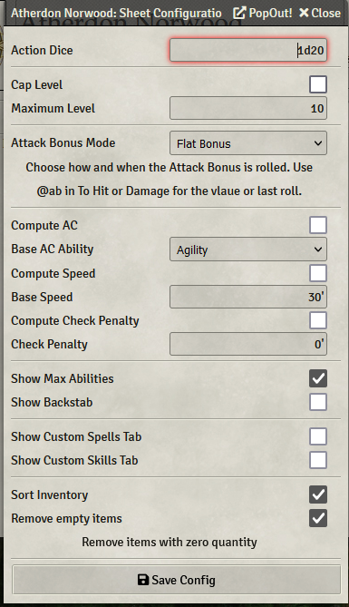

# Action Dice

Config is where you will set Action Dice. You'll typically put a comma-separated list of action dice here for higher-level characters.  Like `1d20,1d16`.

To roll with a different Action Die (e.g. 1d16), Command or Ctrl Click the die icon or attribute label on your sheet and you will get a roll dialog:

