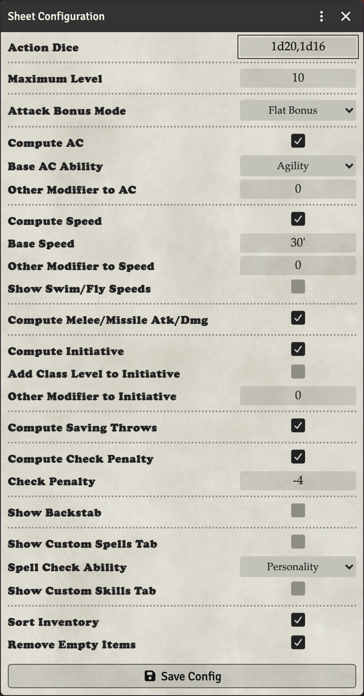
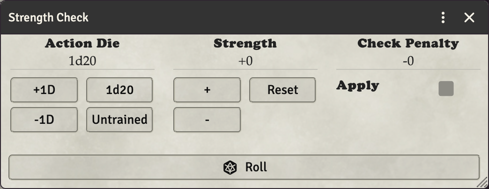

# Action Dice

Config is where you will set Action Dice. You'll typically put a comma-separated list of action dice here for higher-level characters.  Like `1d20,1d16`.

To roll with a different Action Die (e.g. 1d16), Command or Ctrl Click the die icon or attribute label on your sheet and you will get a roll dialog:

## Per-weapon action die

A single weapon can roll a different die than the rest of the sheet. Click the
pencil next to the weapon and fill in the **Action Die Override** field (for
example `1d16`). The override replaces the action die for that weapon only, and
takes precedence over the untrained and two-weapon fighting adjustments. Leave
it blank to use the sheet's action die. NPC attacks have the same field in
their **To Hit** box — see
[NPC Weapon Action Dice](Creating-Importing-an-NPC.md#npc-weapon-action-dice).

To have the system *track* your action dice during combat — spending one per
roll, showing spent/ready pips, and resetting each round — see
[Multiple Action Dice (Tracking)](Multiple-Action-Dice.md).
