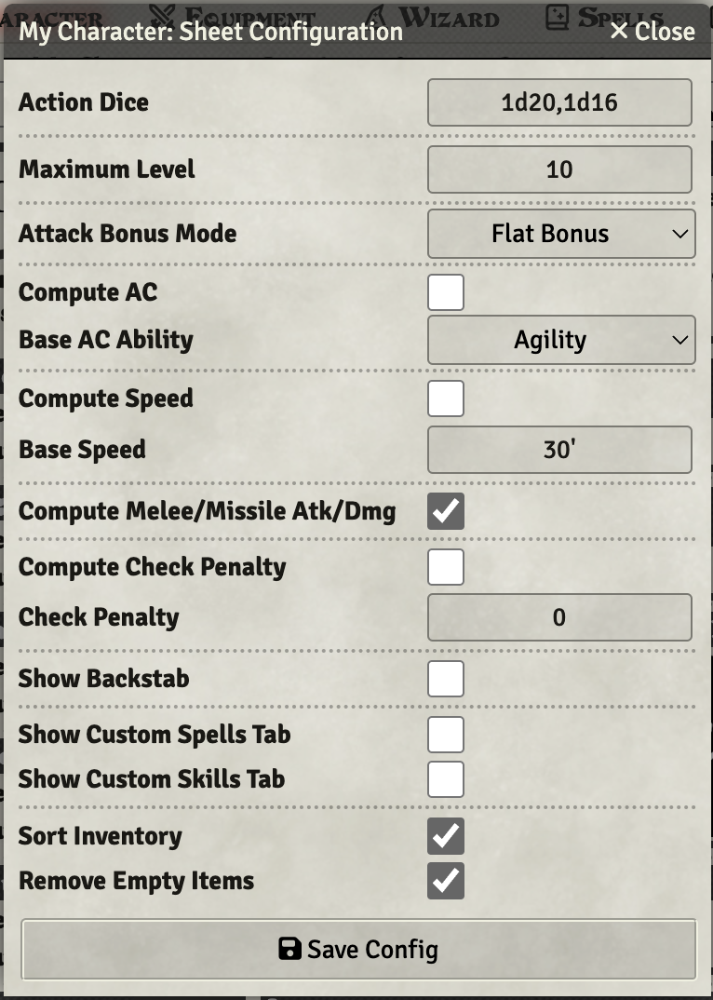

# Advanced Character Settings

To access advanced character settings:

1. Click the **Toggle Controls** button (three vertical dots) in the title bar
2. Click **Config**

This will open a dialog with advanced settings:

**Attack Bonus Mode** allows for Mighty Deeds.
* Flat Bonus is the default mode used by classes without access to Mighty Deeds.
* Roll Per Attack will automatically roll the Deed Die with every attack, the resulting deed roll is available as `@ab`.

The Deed Die itself is set via the **Attack Bonus** field on the Character tab of the sheet.

**Compute AC** will auto-calculate the character's AC based on their agility and any equipped armor. The AC field on the sheet will be greyed out and show the calculated value when this option is enabled. Hovering over it will show the calculations.

**Compute Speed** will auto-calculate the character's speed from a base speed and their equipped armor. The Speed field on the sheet will be greyed out and show the calculated value when this option is enabled. Hovering over it will show the calculations.

**Show Swim/Fly Speeds** will add separate swim and fly speed fields to the character sheet. These are independent of the main speed calculation and allow you to track different movement speeds for characters with special abilities like swimming or flying.

**Compute Check Penalty** will auto-calculate the character's armor check penalty from their armor. Alternatively a static check penalty can be provided in the field below. The check penalty will be applied to any spells cast that are marked as Wizard spells (it does not apply to Cleric spells) and to thief skills. The check penalty can be added or removed from relevant rolls if ctrl (or command) is held to display the Roll Modifier dialog when making the roll.

**Show Backstab** adds the backstab function for Thieves, or custom classes/characters where backstabs are allowed.

**Show Custom Spells / Skills** will add a custom tab for spell or skill rolls for extending the system without creating new character sheets.

Sort Inventory will sort your inventory alphabetically.

Remove empty items will remove any items if their quantity is set to 0.