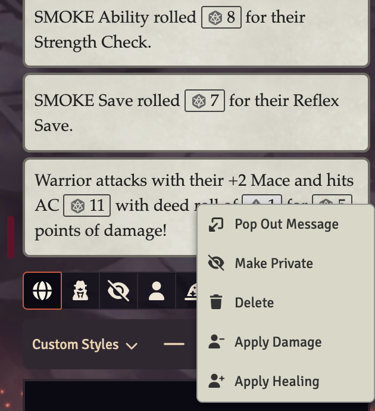
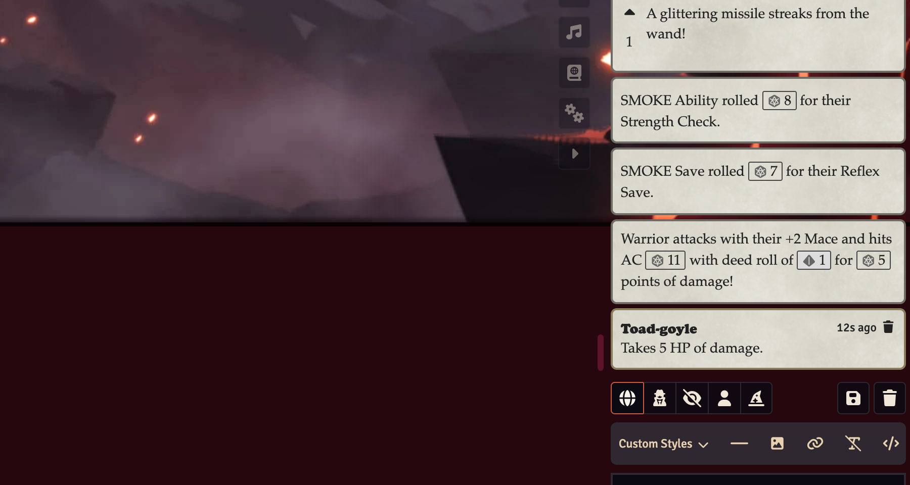

# Applying Damage

You can right click to deal damage or healing to a selected token.

Hatmer in this situation is attacking the Toad-Goyle. He hits for 14 damage. I have selected the Toad-Goyle and right clicked on the attack chat message - you can see the "Apply Damage" option.

After choosing this option, the 13 damage was applied to the Toad-Goyle token's HP, and you can see a messaging confirming that in the chat.

You can do the same thing after a cleric rolls Lay on Hands, but choose Apply Healing.

## Adjusting the Amount at Apply Time

Sometimes the number on the card isn't the number you want to apply — for example, a player decides to spend Luck only after seeing the rolled damage.

Hold Ctrl (Cmd on Mac) while clicking Apply Damage or Apply Healing to open a small dialog instead of applying immediately. (If you have the "Show Roll Modifier by Default" setting enabled, this is reversed: the dialog opens on a plain click, and Ctrl/Cmd-click applies directly.) The dialog is pre-filled with the amount from the card; edit it and press Apply to apply the adjusted amount to the selected tokens.

If the roll came from an actor, the dialog also offers a "Spend Luck" field. Entering an amount there deducts that much Luck from the roller and records the spend in their Ability Score Change Log (when that setting is enabled). The Luck spend does not change the damage number automatically — how Luck modifies a roll is your table's ruling, so adjust the amount field yourself.

