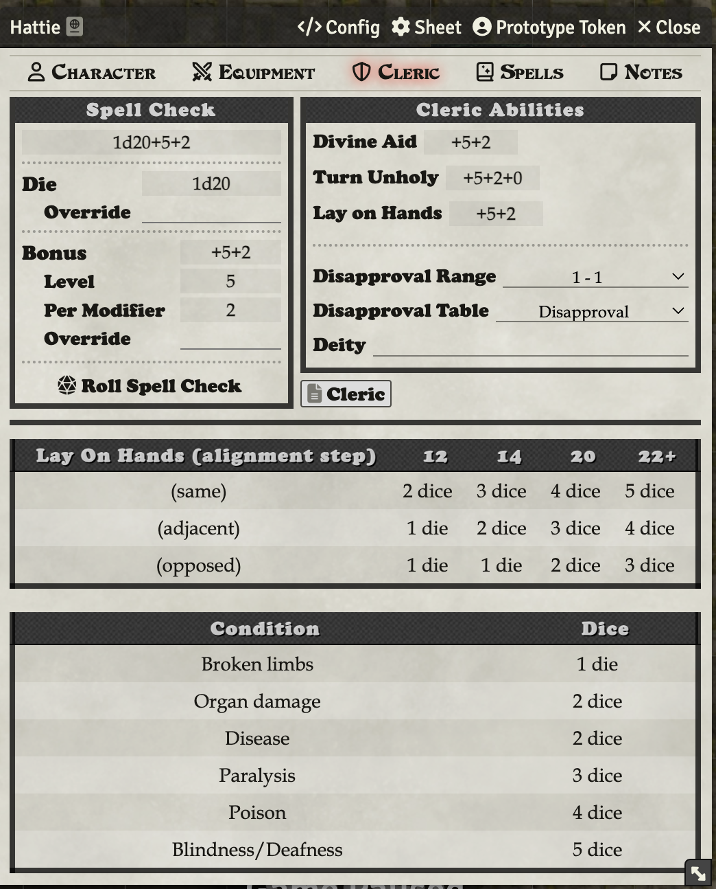
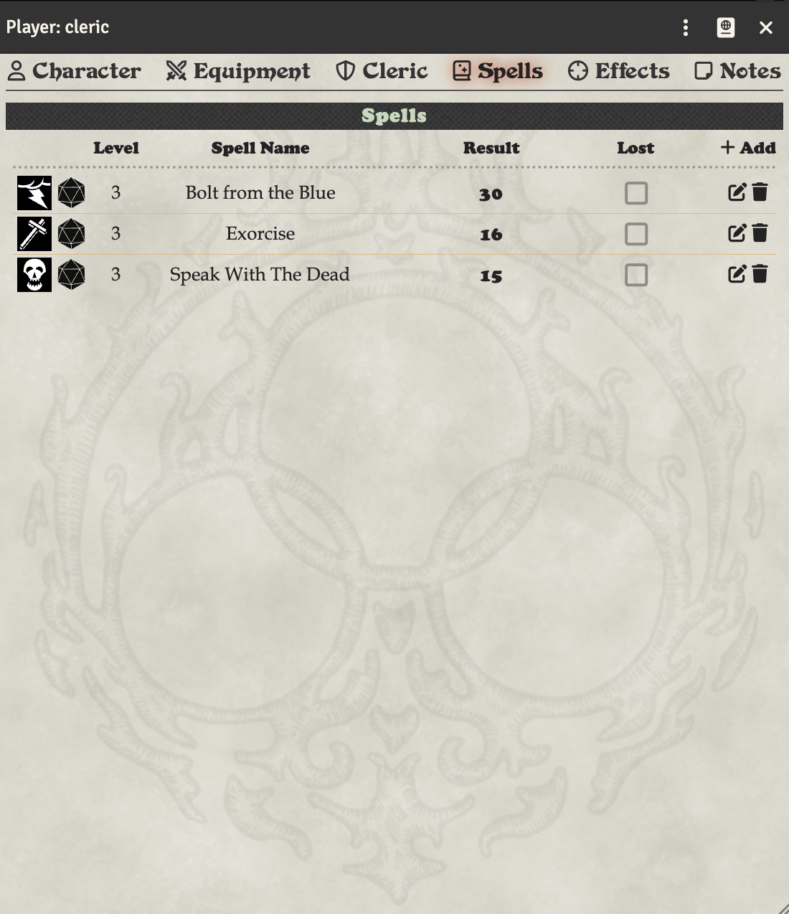

# Cleric

The Cleric tab has the cleric-specific skills, such as Lay on Hands, Divine Aid, and Turn Unholy.

As your cleric accrues disapproval from failed spells, the disapproval number on this tab will go up. You can adjust or reset it manually.

If your cleric's deity has their own disapproval table that you have created, you can choose that here.

There is also a handy reference chart for those skills on this tab.

Cleric spells are on the Spells tab.

## Creating World-Local Disapproval Tables

You can create custom disapproval tables specific to your world or deity. The system will automatically find and add world tables to the dropdown if their name contains "Disapproval" (or the localized equivalent in your language).

### Step 1: Create a RollTable

1. Click on the **RollTables** tab in the sidebar
2. Click **Create RollTable**
3. Fill in the table details:
   - **Name**: Must contain "Disapproval" in the name (e.g., "Cthulhu Disapproval", "Lord of All Smiths Disapproval", or just "Disapproval")
   - **Description**: Optional description of the deity or table
   - **Roll Formula**: Leave blank or set to any formula - it is not used (the system automatically rolls based on the spell check result)
4. Add table results in the **Results** section:
   - **IMPORTANT**: Your first result should have a minimum range of **-500** (or lower) to catch all low rolls
   - **IMPORTANT**: Your last result should have a maximum range of **500** (or higher) to catch all high rolls
   - For each row in the disapproval table, click **Add Result**
   - Set the **Range** to match the DCC disapproval table (e.g., 1-1, 2-3, 4-5, etc.)
   - Set the **Text** to the disapproval effect for that range
   - Example ranges:
     - First result: `-500 to 1` (catches all rolls of 1 or below)
     - Middle results: `2-3`, `4-5`, `6-8`, etc.
     - Last result: `16 to 500` (catches all rolls of 16 or above)
5. Click **Create RollTable** to save

**Why these ranges?** The disapproval roll formula is `(natural spell check roll)d4 - luck modifier`. For example, if you rolled a natural 3 on your spell check with -1 luck, the disapproval roll is `3d4 - (-1)` = `3d4 + 1`, which can range from 4 to 13. Using wide ranges like -500 to 500 ensures all possible results are covered.

### Step 2: Select the Table on Your Cleric

1. Open your Cleric's character sheet
2. Go to the **Cleric** tab
3. In the **Disapproval Table** dropdown, your world table will appear automatically if it contains "Disapproval" in its name
4. Select your custom table from the dropdown
5. The table is now ready to roll when disapproval is incurred

The system will automatically find and list your world table in the dropdown. If you rename the table and remove "Disapproval" from the name, it will be removed from the dropdown automatically.

### Tips

- The table name **must contain "Disapproval"** to appear in the dropdown (e.g., "Zeus Disapproval", "Disapproval of Ares")
- Create a separate RollTable for each deity's disapproval effects
- Each Cleric can select their own deity's disapproval table
- The dropdown updates automatically when you create, rename, or delete tables
- Tables are rollable by clicking the **Disapproval Range** label or dragging it to the hotbar
- If you have the Core Book module, it includes the standard disapproval table automatically
- Works with localized versions of "Disapproval" in other languages (e.g., "Ungnade" in German, "Désapprobation" in French)

