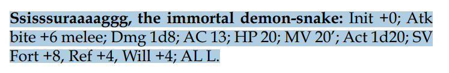
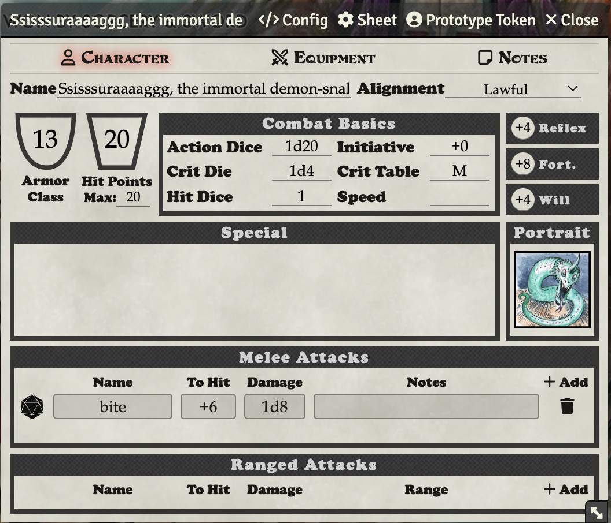
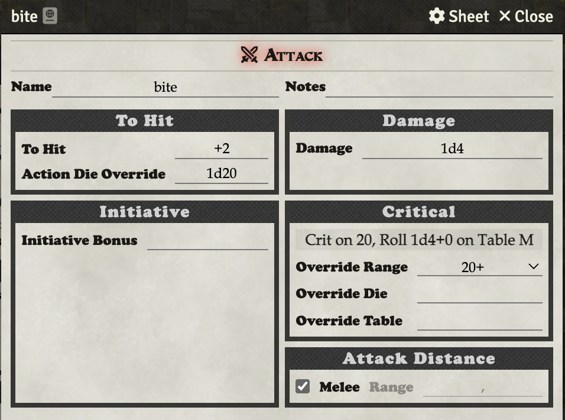

# Creating/Importing an NPC

To import an NPC from a PDF, you can use the importer. Click **Import Actor(s)** at the bottom of the actors tab.

Copy it out of the PDF just like this (**the period has to be included, it is a delimiter**):

Paste into the Import Actors window and hit Import Actor(s).

## NPC Crit Range

To increase the crit range for an NPC, you can change their crit range on each attack. Giants, for example crit on 20-24.

Click on the pencil next to the attack, and then adjust the crit range.
