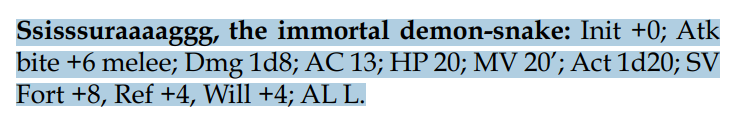
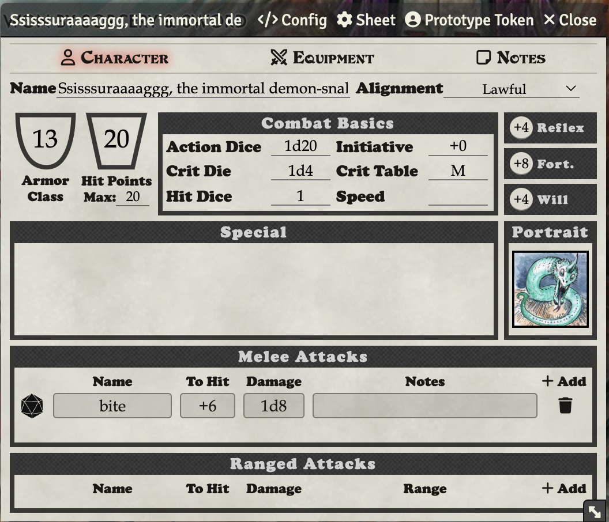
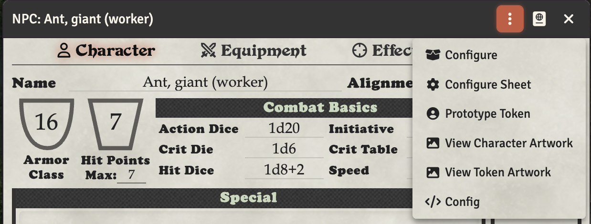
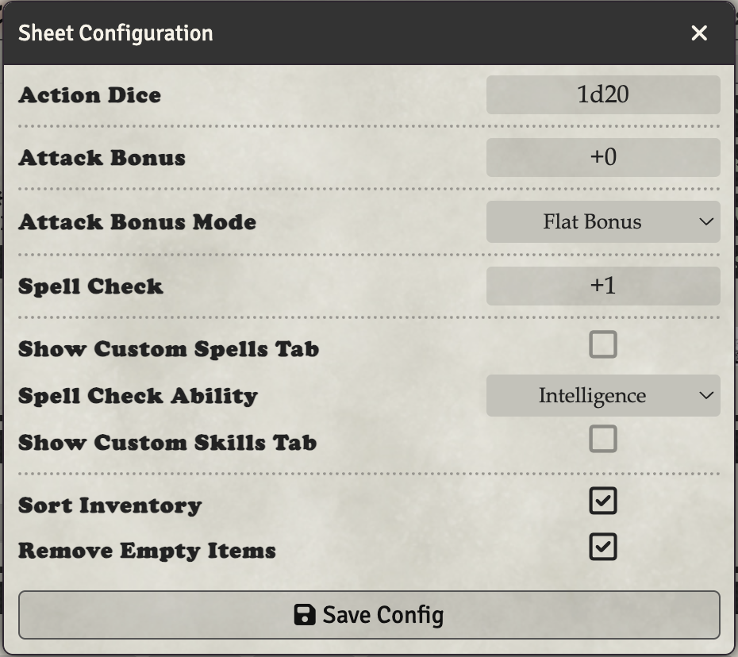
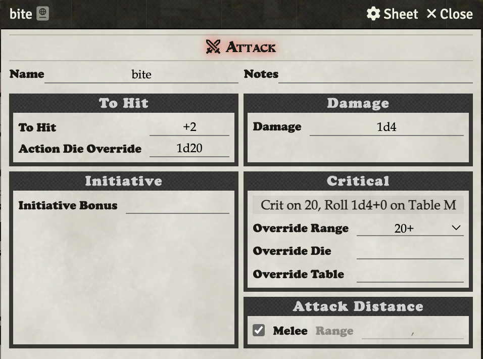

# Creating/Importing an NPC

To import an NPC from a PDF, you can use the importer. Click **Import Actor(s)** at the bottom of the actors tab.

Copy it out of the PDF just like this (**the period has to be included, it is a delimiter**):

Paste into the Import Actors window and hit Import Actor(s).

## Adding Spells or Special Abilities with Rolls

By default, the NPC sheet only shows the basic tabs. If your NPC needs to cast spells or has special abilities that require skill rolls, you can enable additional tabs through the Config menu:

1. Click the title bar menu button and select **&lt;/&gt; Config**

2. In the **Sheet Configuration** dialog, check **Show Custom Spells Tab** to add a **Spells** tab, and/or **Show Custom Skills Tab** to add a **Skills** tab
3. Click **Save Config**

You can then either create or drag spells or skills onto the NPC and roll them from the new tabs just like on a player character sheet.

## NPC Crit Range

To increase the crit range for an NPC, you can change their crit range on each attack. Giants, for example crit on 20-24.

Click on the pencil next to the attack, and then adjust the crit range.
