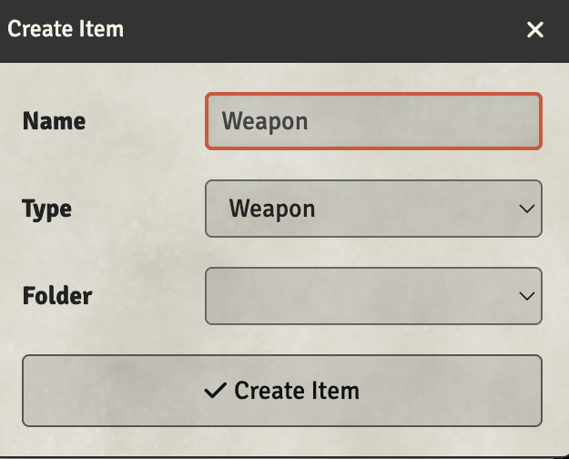

# Creating Re-useable Items

You can create a weapon (mundane or magic) that can be stored in a compendium for other uses, or dragged onto a character if they have that item.

## Creating an Item

1. Click the **Items Directory** tab in the sidebar (looks like a suitcase)
2. Click **Create Item**
3. Enter a name for the item
4. Select the item **Type** (Weapon, Armor, Equipment, Spell, etc.)
5. Optionally select a **Folder** to organize it
6. Click **Create Item**

## Using Re-useable Items

Once created, you can:

- **Drag to character**: Drag the item from the Items Directory onto any character sheet to give them the item
- **Store in Compendium**: Right-click the item and export it to a compendium for use across worlds
- **Share with players**: Items in the directory can be configured with permissions for players to use
