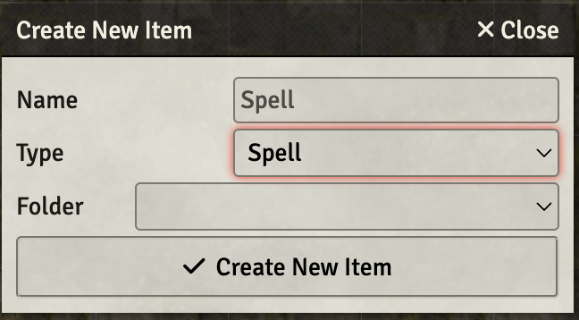
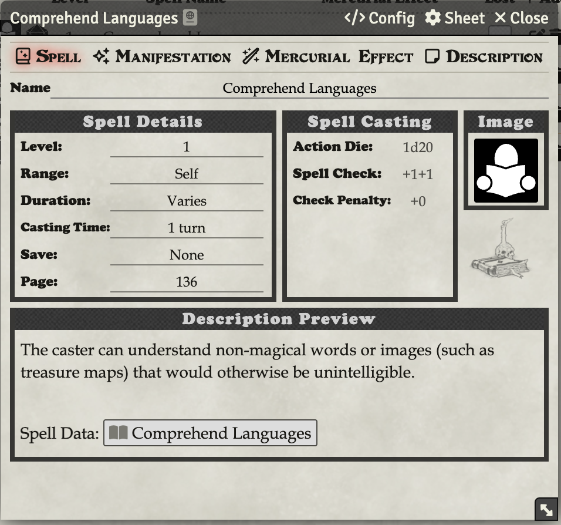

# Creating a Re-usable Spell

Spells are Items in FoundryVTT.

To create a Spell, click **Items Directory** (the suitcase) and click **Create Item**. In the **Type** dropdown, select **Spell**.

Here you can enter data just like from the Wizard or Cleric sheet. Don’t enter Mercurial Magic - players will need to enter that for themselves once they attach it to their character sheet and cast it for the first time.

Once the Spell is created, you can drag it to a Character’s sheet and it will add to their spell list. This way, you can create a spell once, but share it with any number of characters.

