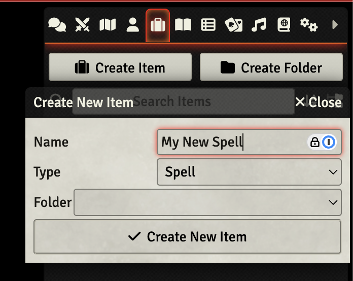
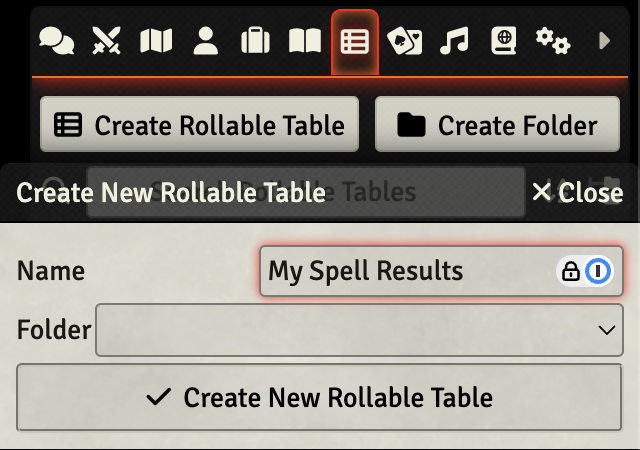
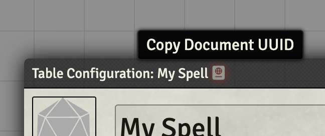
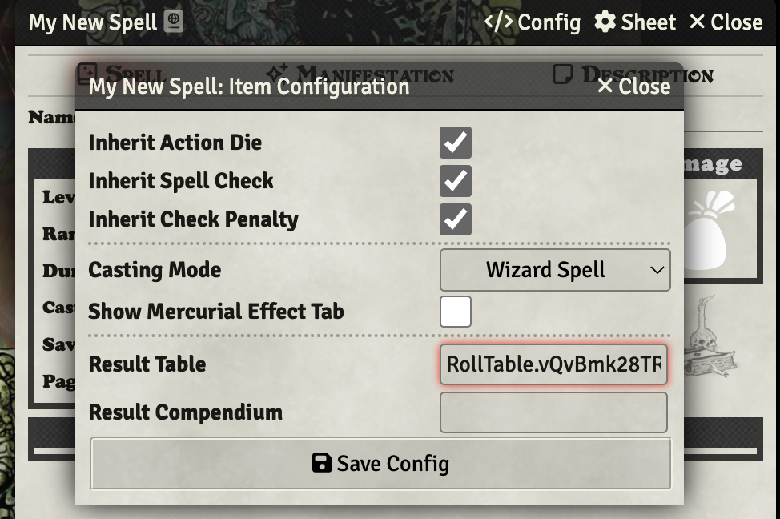
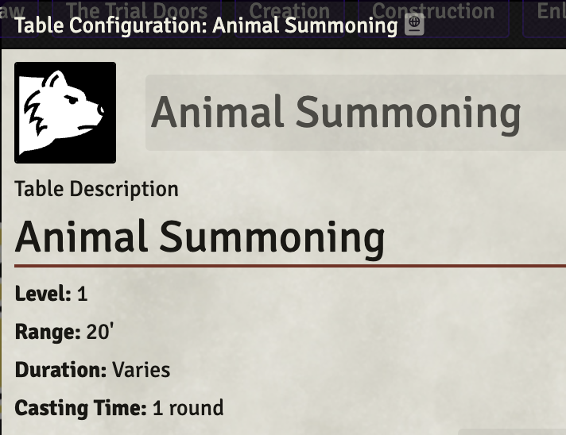

# Creating a Spell

You need to create two things for a rollable spell to work.

1) You need to create an "Item" of type "Spell".

2) You need to create a Rollable Table for the spell results.

You then link the Rollable Table's UUID to the Item so the spell knows what to roll.

To get the Rolltable Table's UUID, click on the little book icon right after the table's name in the RollTable's titlebar.
Note that in versions pre v0.50.12, you'll need to edit the pasted-in-UUID to be only the UUID, and not include `RollTable.`.

If you want it to show the Spell data in the chat when rolled, add that to the description at the top of the Rollable Table.

If you want that format to match the Core Book Spells, the HTML for that is in the [Creating Spell Tables](Creating-Spell-Tables.md) wiki entry.

## Creating the Spell Item:

## Creating the Rollable Table:

## Copying the UUID value:

## Pasting in the UUID into the Result Table field of the Spell Config:

## Spell data in the description of the Rollable Table that will appear in chat when spell is cast:

 
