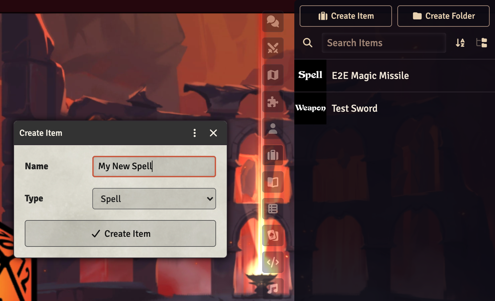
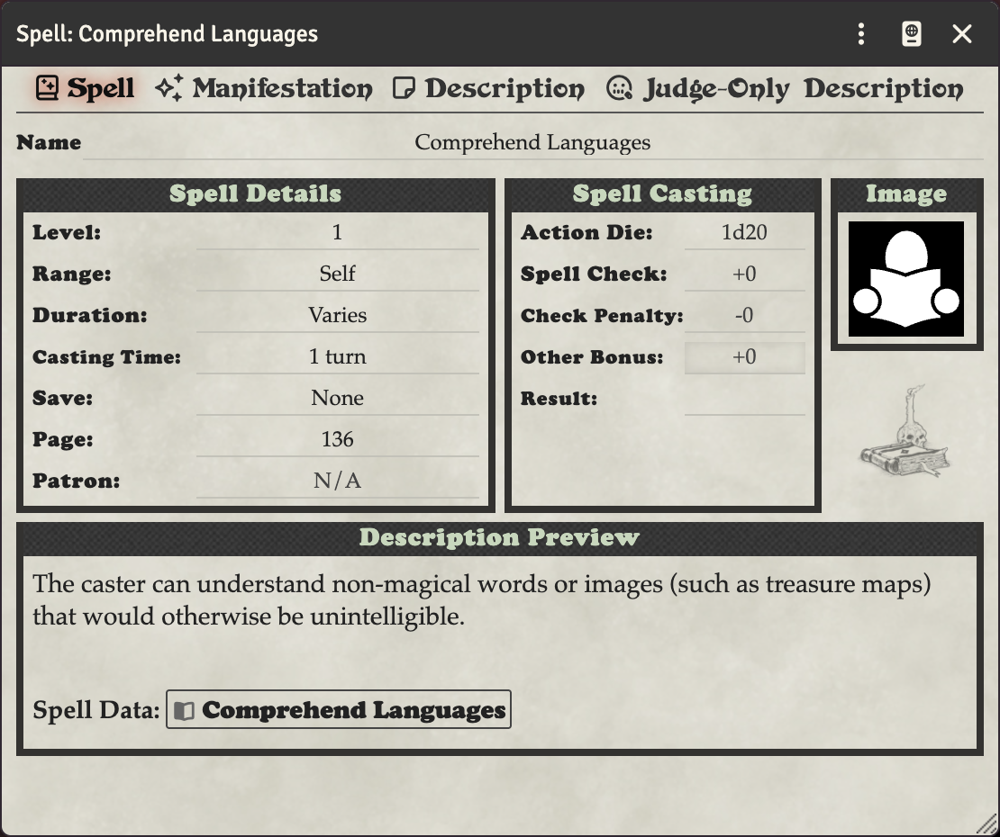
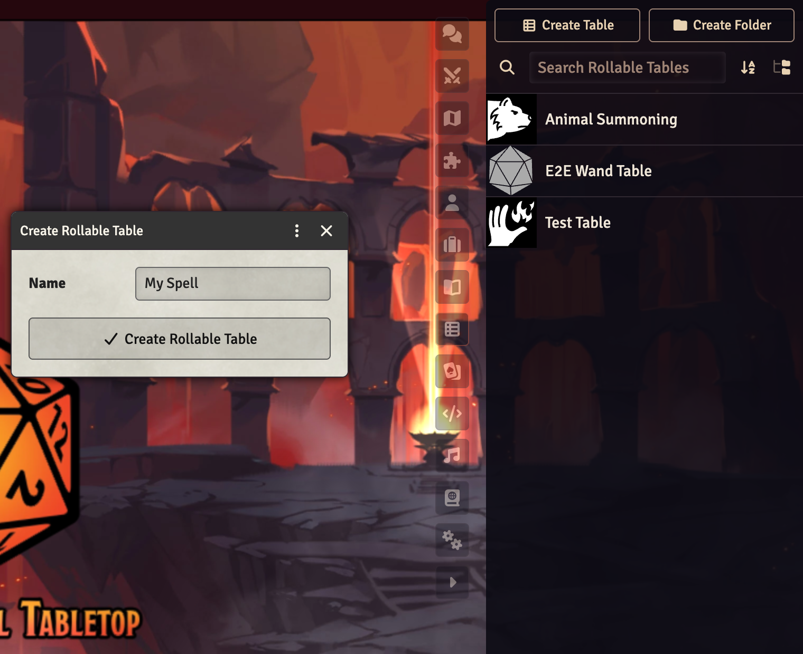
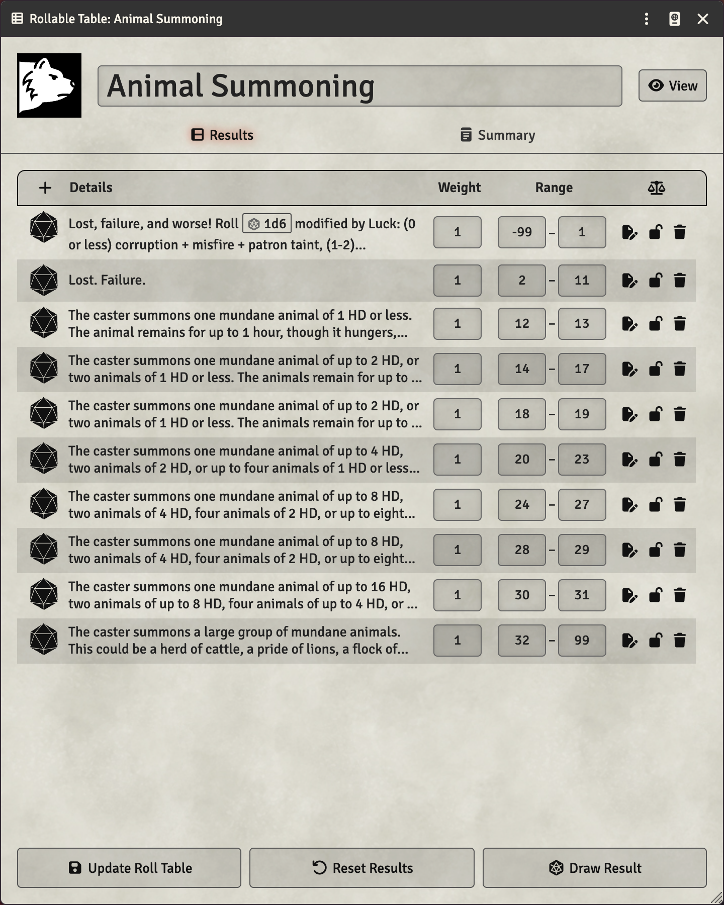
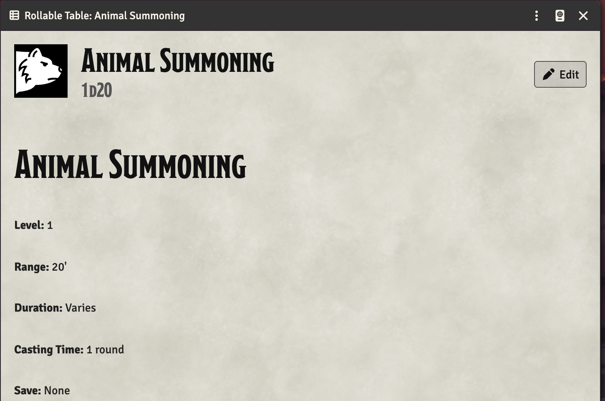
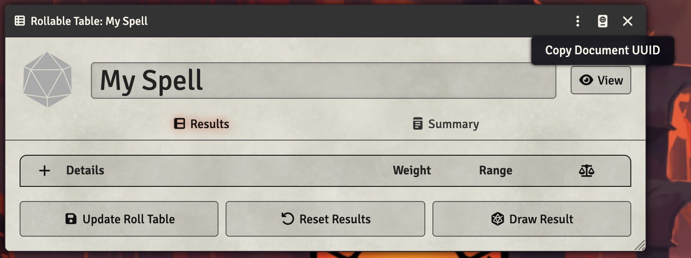
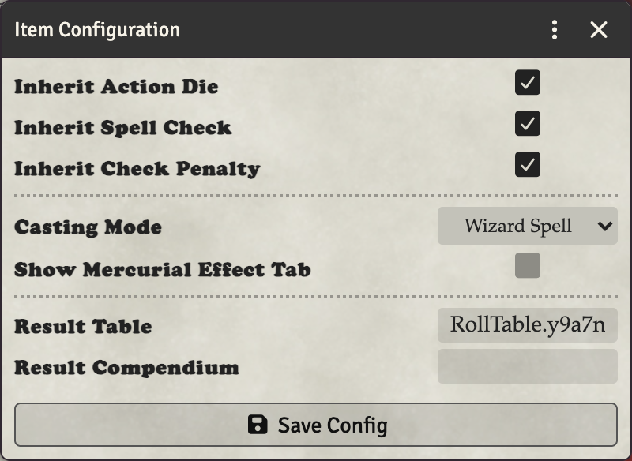
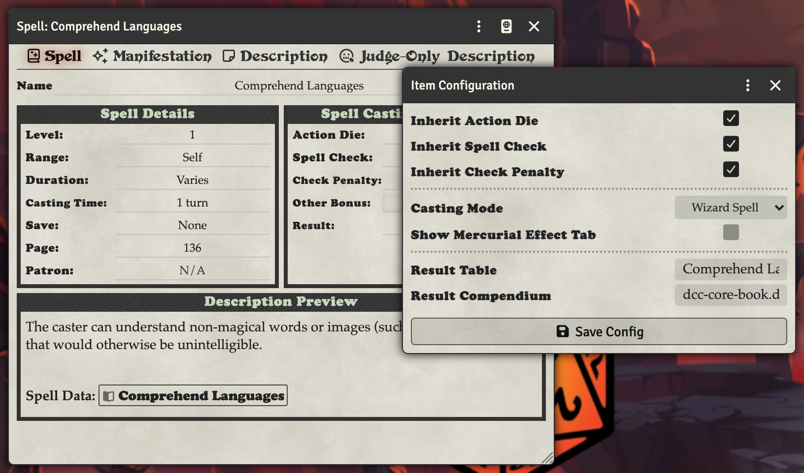

# Creating a Spell

A working, rollable spell in the DCC system is made of two parts:

1. A **Spell Item** — this is what sits on the character sheet and gets cast.
2. A **Rollable Table** — this holds the spell check results (what happens on a 12, an 18, a 32, etc.).

You link the table to the spell so that when the spell is cast, the system automatically looks up the result matching the spell check roll.

> **Save time:** The [DCC Core Book module](Save-Time---Get-the-Core-Book-Module.md) includes every core rulebook spell with its result tables already set up. You only need to build spells by hand for homebrew or third-party content.

## Step 1: Create the Spell Item

Spells are Items in FoundryVTT. Open the **Items Directory** (the suitcase icon) and click **Create Item**. Give it the spell's name and select **Spell** in the **Type** dropdown.



Open the new spell and fill in the spell details (level, range, duration, casting time, save, etc.) just as they appear in the rulebook.



Don't enter Mercurial Magic — each player rolls that for themselves after adding the spell to their character sheet.

## Step 2: Create the Rollable Table

Go to the **Rollable Tables** tab in the sidebar and click **Create Table**. Name the table after the spell.



Add one row per result band from the spell's description, using the **Range** columns for the spell check values. Use a low number like -99 for the bottom of the first row and a high number like 99 for the top of the last row so that extreme rolls still match a result.



### Optional: Show spell data in chat when cast

If you put the spell's stats in the table's **Description**, they will appear in the chat window whenever the spell is cast.



To match the formatting of the Core Book spells, edit the description as HTML (the `</>` button in the editor) and paste in this template, replacing the placeholders with your spell's data:

```html
<h1>SPELL NAME</h1>
<p><strong>Level:</strong> LEVEL</p>
<p><strong>Range:</strong> RANGE</p>
<p><strong>Duration:</strong> DURATION</p>
<p><strong>Casting Time:</strong> CASTING TIME</p>
<p><strong>Save:</strong> SAVE</p>
<p><strong>Page:</strong> PAGE #</p>
<p>SPELL FLAVOR TEXT</p>
```

### Optional: Manifestation, Misfire, and Corruption tables

If the spell has Manifestation, Misfire, or Corruption sub-tables, create each of those as its own Rollable Table the same way (e.g. *Animal Summoning Manifestation*, *Animal Summoning Misfire*, *Animal Summoning Corruption*). Then link them from the main spell table's description so the judge can jump straight to them from chat: drag each sub-table from the sidebar into the description editor to create a link, like so:

```html
<p><strong>Manifestation:</strong> @UUID[...]{SPELL NAME Manifestation}</p>
<p><strong>Misfire:</strong> @UUID[...]{SPELL NAME Misfire}</p>
<p><strong>Corruption:</strong> @UUID[...]{SPELL NAME Corruption}</p>
```

(Dragging the table into the editor fills in the `@UUID[...]` link for you.)

The **Roll Manifestation** button on the spell finds its table by the *`SPELL NAME` Manifestation* naming convention, searching the configured Spell Side Effects compendium first and then your world's Rollable Tables. Worlds running a translation module (e.g. Babele) are handled automatically — the lookup also matches on the untranslated original names. Advanced pack authors can instead point a spell at an arbitrarily-named table by setting `system.manifestation.table` (a table name, id, or `RollTable.<id>`) and optionally `system.manifestation.collection` (a compendium key) in the spell's source data, mirroring how `system.results` references the spell-check results table.

## Step 3: Link the Table to the Spell

The spell needs to know which table to roll on. There are two ways to connect them:

**Option A — Drag and drop (easiest):** Open the Spell Item and drag the Rollable Table from the sidebar (or from a compendium) onto the spell's sheet.

**Option B — Copy the UUID:** Open the Rollable Table and click the small ID card icon in its title bar (**Copy Document UUID**).



Then open the Spell Item, click the **⋮** menu and choose **Config**, and paste the UUID into the **Result Table** field. Click **Save Config**.



To verify the link worked, open the spell's **Config** — you should see data in the **Result Table** field (and **Result Compendium**, if the table came from a compendium):



## Step 4: Add the Spell to a Character

Drag the finished Spell Item from the Items Directory onto a character sheet and it will appear in their spell list. You can create a spell once and share it with any number of characters this way.

Casting it from the **Spells** tab of the character sheet rolls the spell check, looks up the result on the linked table, and posts both to chat.
