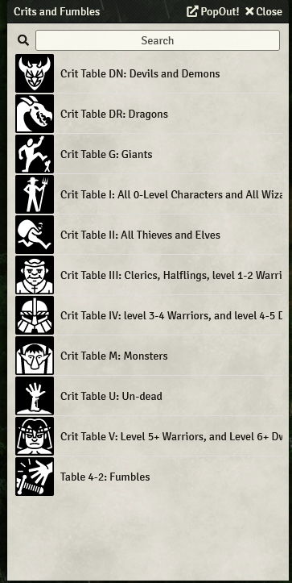
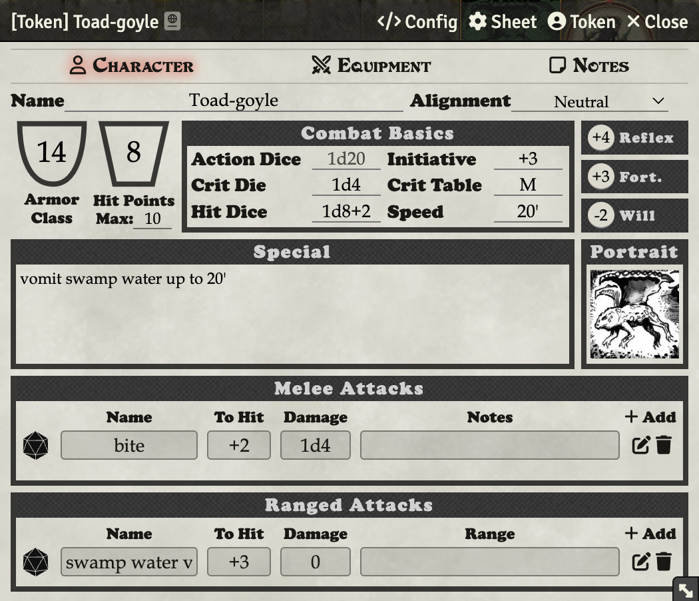

# Critical Hits

You can add critical hit tables and put them in a compendium. That way you can automatically roll a critical hit when you roll a natural 20. Just import a table with EasyTable, and title it:

Then when you reference a crit table (in the character or NPC’s sheet) it will automatically be rolled on, as long as it meets that syntax, and as long as you have referenced your compendium in System Settings.

This Toad-Goyle will use Crit Table M:

