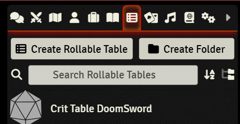
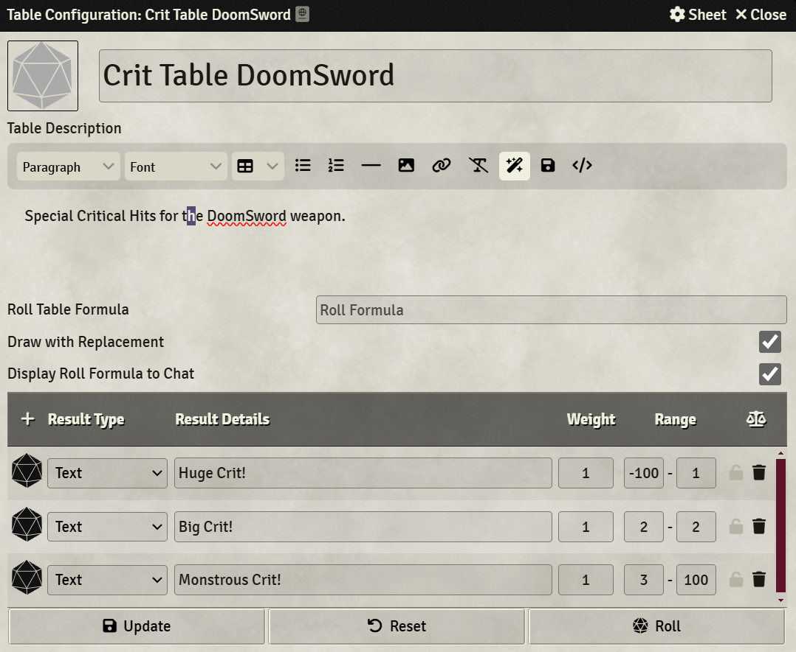
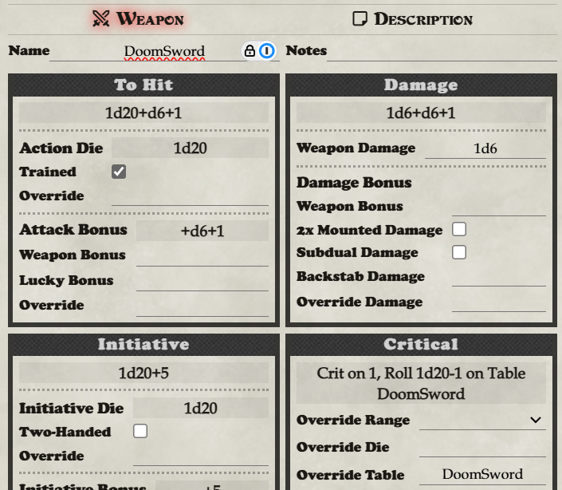

You can create a custom Critical Hit Table in your world.

### Here are the steps:

1) Create a RollTable named 'Crit Table XXXX' where XXXX is the short name you want to use.
2) Use just this short name to refer to your table from the actor, either in their "Combat Basics" or in the "Crit Table Override" on a weapon.

### Images

###Creating the Critical Hit table in your world:

Referring to this crit table from a weapon Override Table:

