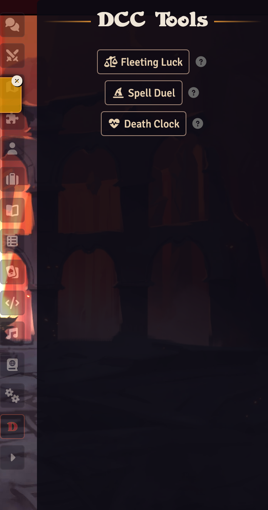
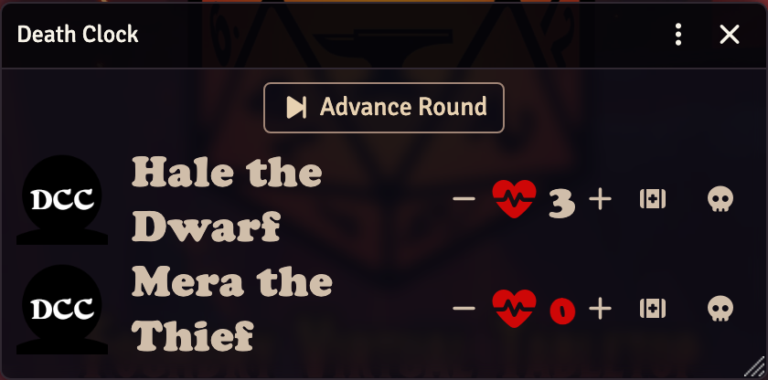

# Death Clock

## Overview

The Death Clock implements the DCC death and dying rules for player characters. Enable it through **System Settings → Enhanced Combat → Enable death clock for PCs** (off by default).

Per the rules, a 1st-level or higher character reduced to 0 hit points collapses and begins **bleeding out**: they can be healed on the round they dropped or within their level in rounds afterward. Level 0 characters die immediately at 0 hit points.

## The clock

When a player character drops to 0 HP they gain the **Dying** condition carrying the countdown, and the drop is announced in chat. In combat, the tracker shows the rounds remaining next to their name at the end of the action-dice pips, and each round advance burns one round. Only forward round advances count — a judge stepping the tracker back to fix a misclick will not burn (or end) the clock, and starting a combat does not count as an elapsed round.

When the countdown reaches **0**, that round is the character's **final chance** — the badge tooltip says so and a warning is posted to chat. One more round and they die.

Death is applied exactly as if the judge had clicked the combat tracker's skull button: the dead status overlay on the token, and the combatant marked defeated. Un-defeating later works the same way as for the skull button too.

The **Dying** condition can also be applied manually from the token's right-click status menu — a manually applied clock starts at the character's full (level)-round window.

## Saving a character

**Healing while bleeding out** (raising them above 0 HP before the clock runs out) saves the character — at the price the rules demand: a **permanent loss of 1 Stamina** and a **terrible scar**, announced in chat. With the Ability Score Log enabled, the loss is recorded as a "Saved from bleeding out (Stamina)" entry (permanent — the log's Heal button won't restore it), including any knock-on maximum-HP change if the Stamina loss crosses an ability modifier threshold.

**Healing a dead character** above 0 HP revives them with no penalty — this is the judge's manual override. The dead status and defeated marker are both removed, and the revival is announced.

## Recovering the body

Every death announcement carries a judge-only **Roll the Body** button, implementing the "recovering the body" rule. If an ally reaches the body within an hour (the judge's call), click it to make the dead character's roll-under Luck check — posted as a normal Luck check card:

- **Success** — they were merely knocked out: they wake with 1 hit point and gain the **Groggy** condition for the next hour (−4 to all rolls; Groggy is also in the token status menu). The success card then prompts the judge to **Roll Ability Loss (1d3)**: the card shows the rolled die, the chart (1 Strength, 2 Agility, 3 Stamina) with the rolled row highlighted, and the permanent −1 is applied automatically — logged as a "Roll the Body injury" entry.
- **Failure** — the character is truly dead.

Each card button is single-use, so a double-click can't apply anything twice.

## The Death Clock tracker

Open the **Death Clock** tool from the **DCC Tools** sidebar tab — the DCC logo near the bottom of the right-hand sidebar tab bar (the tool appears there while the setting is enabled, and the **?** beside each tool links to its user guide page).

The tracker lists every character currently bleeding out, with their portrait and rounds remaining — a red **0** marks a final-chance round. Players can look; the controls are judge-only:

- **Advance Round** — the manual out-of-combat tick: every bleeding-out character loses one round, with the usual final-chance warning and death resolution. Use it when the party is out of initiative but the clock should still run.
- **+ / −** — adjust an individual clock by a round.
- **Stabilize** (medkit) — stop a clock with no penalty, for when the judge rules the character is out of danger without formal healing.
- **Mark as dead** (skull) — resolve the clock as death immediately, with the Roll the Body prompt.

The tracker updates live as characters drop, tick, are healed, or die. Clicking a portrait opens that character's sheet.
