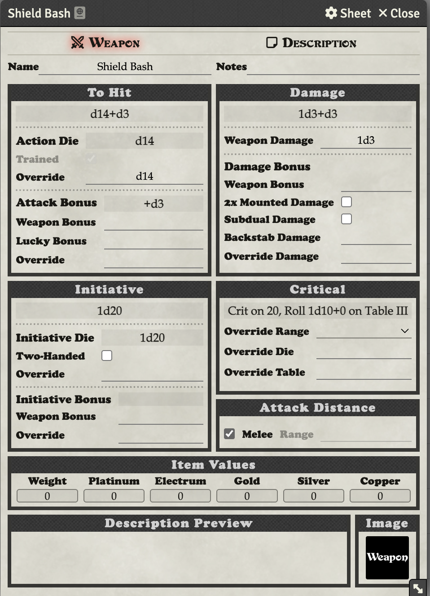

# Dwarf

## Setting Up a Dwarf

First, select the "Dwarf" sheet type:

1. Click the **Toggle Controls** button (three vertical dots) in the title bar
2. Click **Configure Sheet**
3. In the **This Sheet** dropdown, select **Dwarf**
4. Click **Save Sheet Configuration**

## Dwarf Tab

The Dwarf tab shows the Mighty Deed of Arms section and Lucky Weapon field, similar to Warriors.

## Shield Bash

When you first select the Dwarf sheet, a "Shield Bash" weapon is automatically added to the Weapons section of the Equipment tab.

## Attack Bonus Mode

Dwarves use the "Roll Per Attack" attack bonus mode (like Warriors) to roll their deed die with each attack. Set this in the Config menu by clicking the Toggle Controls button and selecting Config.
