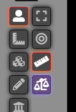
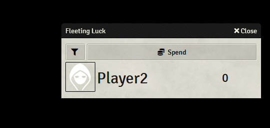
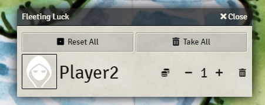
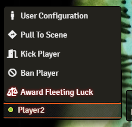

## Fleeting Luck Overview
Enable Fleeting Luck through System Settings -> Enable Fleeting Luck. It is a checkbox near the bottom. Fleeting Luck works on a per-**player** basis, not per-actor. So if a player has multiple actors, they will still only have one "stack" of Fleeting Luck. The player avatar in the dialog is based on the user's avatar, clicking it will open the User Configuration dialog to allow quickly setting it.

Fleeting luck is implemented in the DCC system through an icon on the Token Controls bar. Click the scales icon to open the Fleeting Luck dialog.

Fleeting Luck is automated by default and will clear all players' Fleeting Luck on a roll of a 1, or grant a point to that player on a roll of 20. GM users are ignored for automation purposes.
## Fleeting Luck - Player

For the player, the dialog presents the amount of fleeting luck each player has. The filter button in the top left changes from ALL players, or just the logged in player. Click the spend button to spend Fleeting Luck. You will get a dialog allowing you to choose how much Fleeting Luck to spend. Spending Fleeting Luck will send a chat message with the player and how much Fleeting Luck they spent.

## Fleeting Luck - Judge

For the Judge, the dialog allows you to reset all players to 1 Fleeting Luck, clear away all Fleeting Luck, or award or reduce an individual players' Fleeting Luck. The poker chips icon will allow you to spend it on behalf of a player too.

Changes to Fleeting Luck will be logged to the chat.

You can also award Fleeting Luck by right clicking a player in the User List at the bottom left of the screen.

