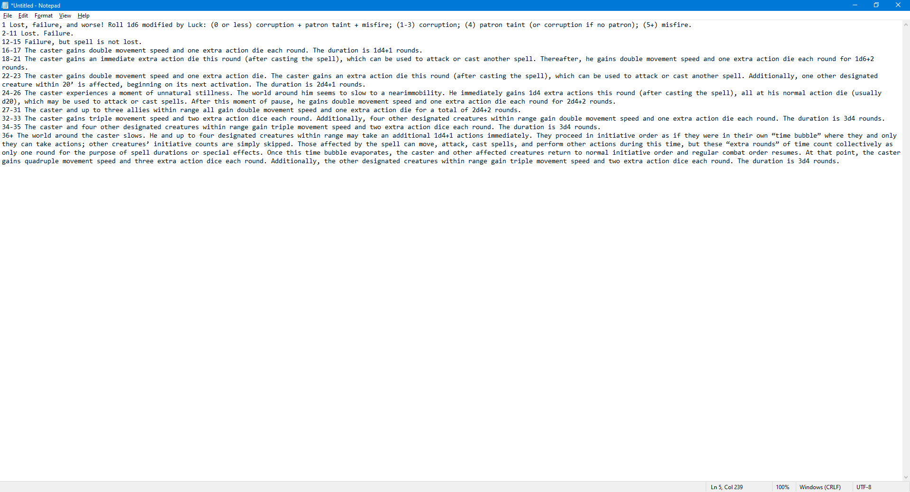
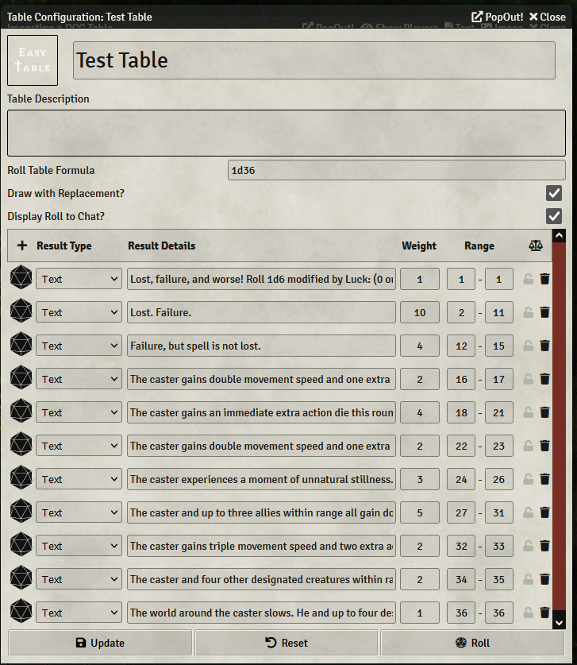

You can use the **[Roll Table Importer](https://foundryvtt.com/packages/roll-table-importer)** module to import a table straight from a PDF. First make sure the module is installed and enabled. The **Table Importer** setting should be enabled by default under **Module Settings**.

Next, go to the **Rollable Tables** tab in the upper right of the Foundry interface and click **Import Tables** at the top of the sidebar.

Copy/paste your table from the PDF into Notepad (or Notes on the Mac). Make sure each line is a number, followed by an entry. If the entry is very long it can word wrap, but **make sure it is all part of the same line**. If it isn't, the table won't come out right. You may also want to do a find and replace on "- " to remove the hyphenations.

Paste from Notepad/Notes into the text area in the **Import Rollable Table** dialog and click **Okay**.

The table is generated and you can roll on it. You may need to correct the **Roll Table Formula**.