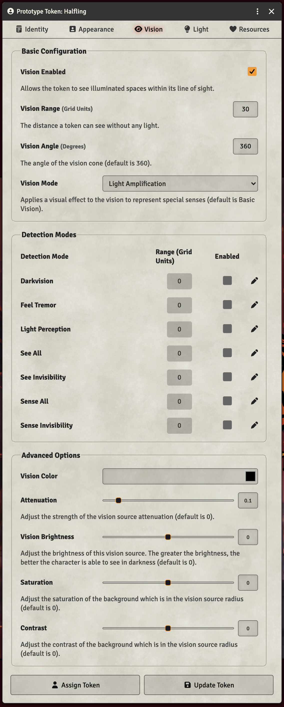
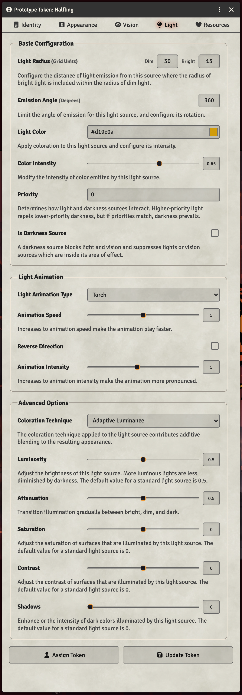

## Infravision

Dwaves, Elves, and Halflings have Infravision, allowing them to see in the dark. Dwarves and Elves can see in the dark up to 60'. Halflings can see in the dark up to 30'. This is pretty easy to set up in Foundry, assuming your scenes are following the default lighting setup.

Foundry's [token guide](https://foundryvtt.com/article/tokens/) should be your main reference, but here are some quick config options.

Open the character sheet for the character you want to grant Infravision to. Click **Prototype Token,** then **Vision**.

Make sure **Vision Enabled** is checked. This needs to be checked for every player token anyway. Then set **Vision Range** to the distance the character can see in the dark (60 for Dwarves and Elves, 30 for Halflings). If you want the classic infravision look, set **Vision Mode** to **Light Amplification**. Click **Update Token** and drag a new copy of that token onto the scene. Select the token and you will see their vision.

## Torches

Torches work just a little bit differently. You can set up the character to produce light from their token, like a torch, lantern, or a magic item. Open the **Prototype Token** dialog again and go to the **Light** tab. Look for **Light Radius** and set the **Dim** and **Bright** distances to whatever you feel fits. Generally, a good distance for a torch is 30 Dim, 15 Bright. This reflects the light being brighter as you get closer to the torch. Then select the **Light Animation Type** dropdown and pick Torch.

The character token will now produce a flickering light that **all** players can see, as long as they have vision.

You can experiment with different light animation types, colors, and intensities to represent lanterns, candles, spell effects, or glowing magic items.

