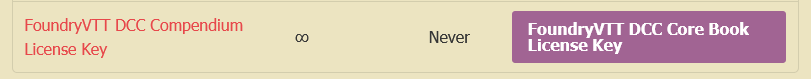
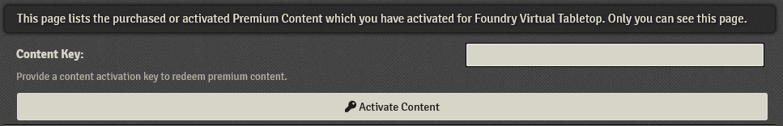
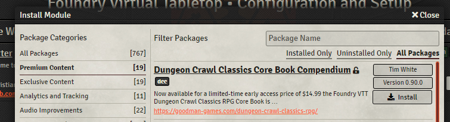
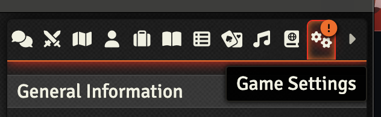
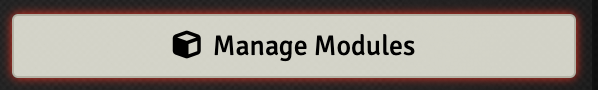
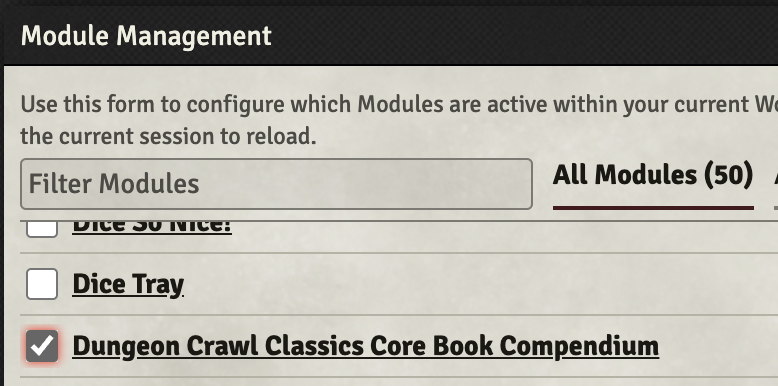

## If you purchased from Goodman-Games.com - Activating Your Key
To activate your module, go to your dashboard on the Goodman Games online store. Hit the Downloads button and you will see a PDF link (this example is for the Core Book, you will see a similar link for other modules):

Download this PDF, which has your key in it.

Head to [Foundry VTT's website](https://www.foundryvtt.com) to activate your product. In the top right, log in, then click your username. In the bottom left, you will see a Premium Content button. Click this, and you will see a page to enter your key:

Enter your key and click Activate Content. The Paid Foundry module is now linked to your account.

## For All Users - Installing the Module in Your Foundry Server
Go to your Foundry server in your browser and click Install Module from the Add-on Modules tab in Setup.

Click Premium Content on the left, and you can install your new module (choose the correct one from the list):

## For All Users - Activating the Module in Your World
Go into your world, click the "Settings" tab, and then choose "Manage Modules". Check the boxes for the paid module you wish to use (e.g. the Dungeon Crawl Classics Core Book).

## For All Users - Read the User Guide
Make sure you look over the [User guide for the DCC System](https://foundryvtt-dungeon-crawl-classics-user-guide.readthedocs.io/)

