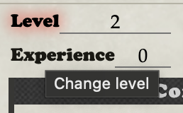
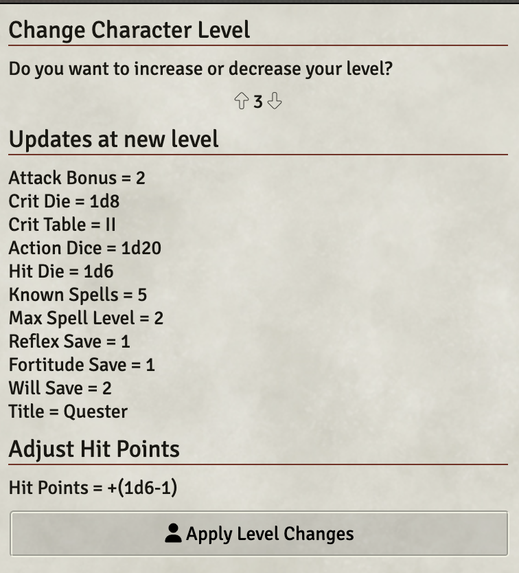

# Level Up

You can level up and down your character if you have the DCC Core Book module installed in your world.

Just click on the "Level" label next to the level of your PC:

...and it will bring up a dialog to let you select a new level and preview the effects of that change:

Once you accept this change, it will be logged to the Chat, and the Hit Points will be rolled.

If you would like a different Hit Point formula, you can roll that in the chat yourself, and adjust your character as desired.