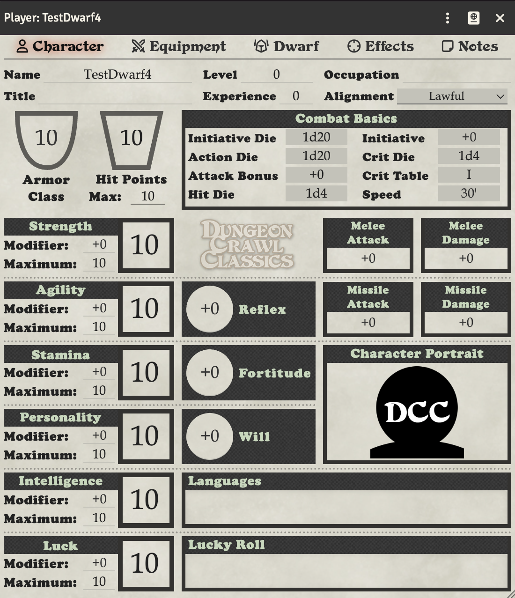

# Mighty Deeds

Warriors and Dwarves can perform Mighty Deeds of Arms. To use this feature, you need to configure your character's Attack Bonus Mode.

## Setting Up Mighty Deeds

1. Click the **Toggle Controls** button (three vertical dots) in the title bar
2. Click **Config**
3. Set **Attack Bonus Mode** to **Roll Per Attack**
4. Click **Save Config**

This will automatically roll your deed die with every attack.

## Attack Bonus Field

Set the **Attack Bonus** field on the Character tab to your character's deed die (e.g., 1d3 for a level 1 Warrior).

The deed die result is automatically added to your attack and damage rolls.

## Using @ab in Weapons

You can use `+@ab` in your weapon's to hit and damage fields to include the deed die result. This is useful if you need to customize how the deed die is applied.

## Automatic vs Manual Rolling

- **Roll Per Attack** (recommended): The deed die is rolled automatically with each attack
- **Flat Bonus**: Use this if you want to manually roll the deed die before attacking

See [Advanced Character Settings](Advanced-Character-Settings.md) for more details on the Attack Bonus Mode setting.

