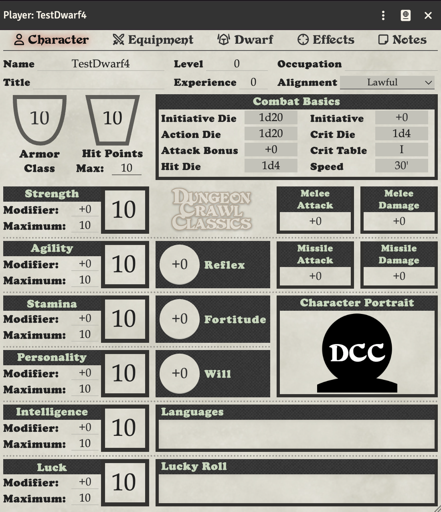

# Mighty Deeds

Warriors and Dwarves can perform Mighty Deeds of Arms. To use this feature, you need to configure your character's Attack Bonus Mode.

## Setting Up Mighty Deeds

1. Click the **Toggle Controls** button (three vertical dots) in the title bar
2. Click **Config**
3. Set **Attack Bonus Mode** to **Roll Per Attack**
4. Click **Save Config**

This will automatically roll your deed die with every attack.

## Attack Bonus Field

Set the **Attack Bonus** field on the Character tab to your character's deed die (e.g., 1d3 for a level 1 Warrior).

The deed die result is automatically added to your attack and damage rolls.

## Using @ab in Weapons

You can use `+@ab` in your weapon's to hit and damage fields to include the deed die result. This is useful if you need to customize how the deed die is applied.

## Automatic vs Manual Rolling

- **Roll Per Attack** (recommended): The deed die is rolled automatically with each attack
- **Flat Bonus**: Use this if you want to manually roll the deed die before attacking

See [Advanced Character Settings](Advanced-Character-Settings.md) for more details on the Attack Bonus Mode setting.

## Mighty Deed Table Prompt (optional)

When enabled, a successful deed (a deed die of **3 or higher**) adds a prompt to the attack chat card: a dropdown of available Mighty Deed tables plus a **Roll Deed** button. Pick the table for the deed you declared and click **Roll Deed** to look the deed die result up on that table and post the outcome to chat.

This feature is **off by default**. To turn it on:

1. Open **Game Settings → Configure Settings → Dungeon Crawl Classics**
2. Enable **Enable Mighty Deed Tables**

Tables are gathered from two places:

- **World roll tables** whose name contains **"Deed"** are picked up automatically (created, renamed, and deleted tables update live).
- A **Mighty Deeds Tables Compendium** can be selected under the manual compendium settings; modules (such as the core rulebook content) can also register deed-table packs via the `dcc.registerMightyDeedsPack` hook.

If no deed tables exist, or the deed fails, the attack card is unchanged and no prompt appears.

