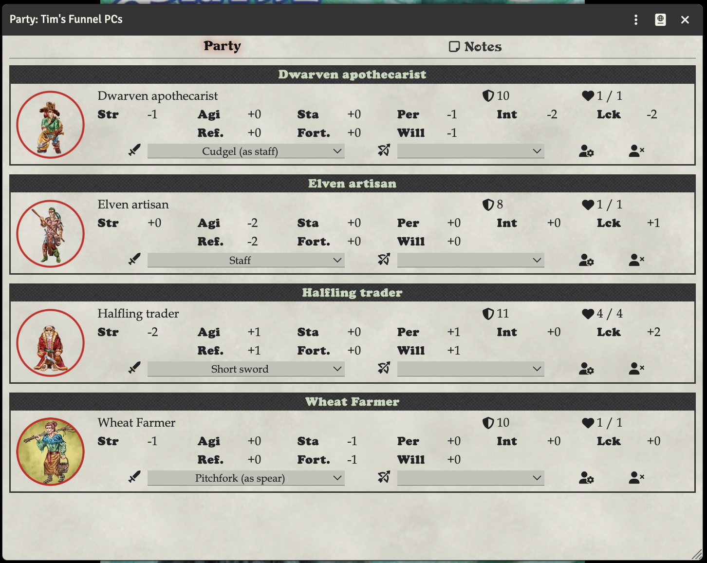
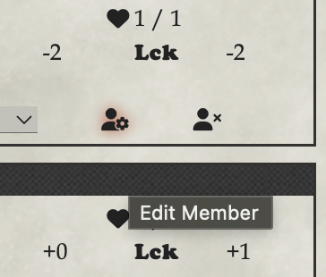
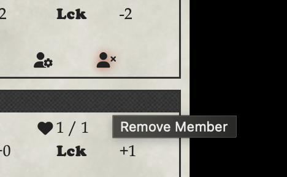
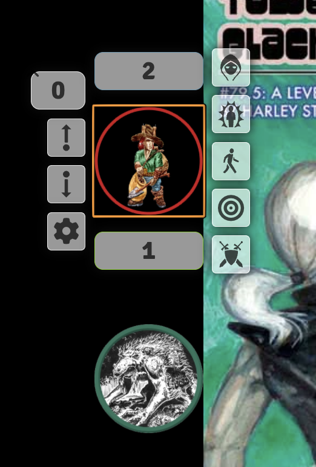

# Party Sheet

You can create an Actor of type "Party" to represent your party. This actor allows you to drag and drop other actors onto the Party Sheet, so you can move and manage them as one.

Useful for overland maps, or for funnels. A party could represent all the PCs controlled by a player in a funnel.

## Creating a Party Actor

## Adding Actors to the Party
You drag actors from the Actors tab onto the Party Sheet.

## Editing Actors in the Party
THere is a button that is a person with a gear in the lower right of each actor on the party sheet. Click that to open the regular actor sheet for that actor.

## Removing Actors from the Party
There is a button that is a person with an X in the lower right of each actor on the party sheet. Click that to remove the actor from the party.

## Using the Party Actor on the map
You can drag the Party Actor onto the map, and it will create a token for the party. You can then move the token around the map to represent the position of the party.

You can then double-click this to see the party sheet. You can use the gear on the token on the map to set it's icon.

## Using individual tokens on the map
You can still drag individual actors onto the map, and they will create their own tokens. You can then move them around the map individually.

You can use the topmost box when you right-click a token to edit their hp - you can type expressions like '-2' or '+2' to make incremental changes to their HP.

