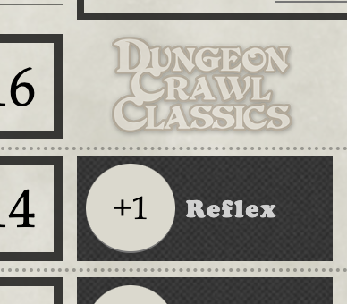
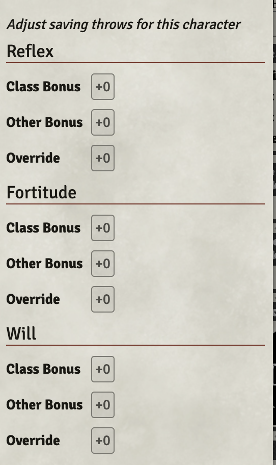

# Saving Throws

Saving throws are auto-calculated by default.

You can disable this in the </>Config menu for a character with this checkbox:

To edit the calculation for a Saving throw, click in the value for a save like you were going to edit it:

This will bring up a dialog where you can edit the class bonus for a character, as well as adding an extra bonus.

You can use the Override to override the calculation entirely with a value of your choice. This enables you to keep the auto-calculation on for other saves.