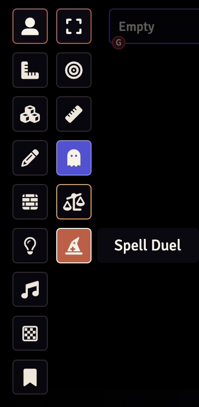
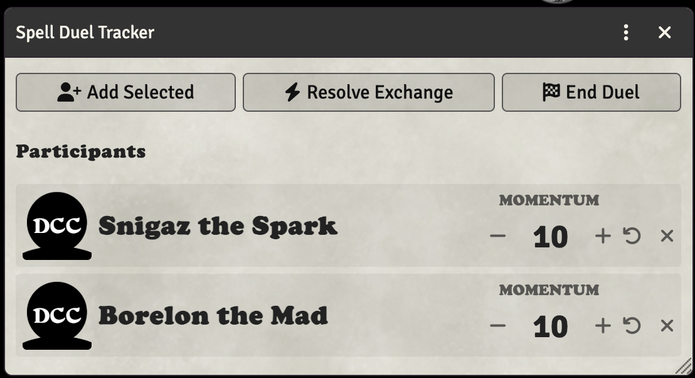
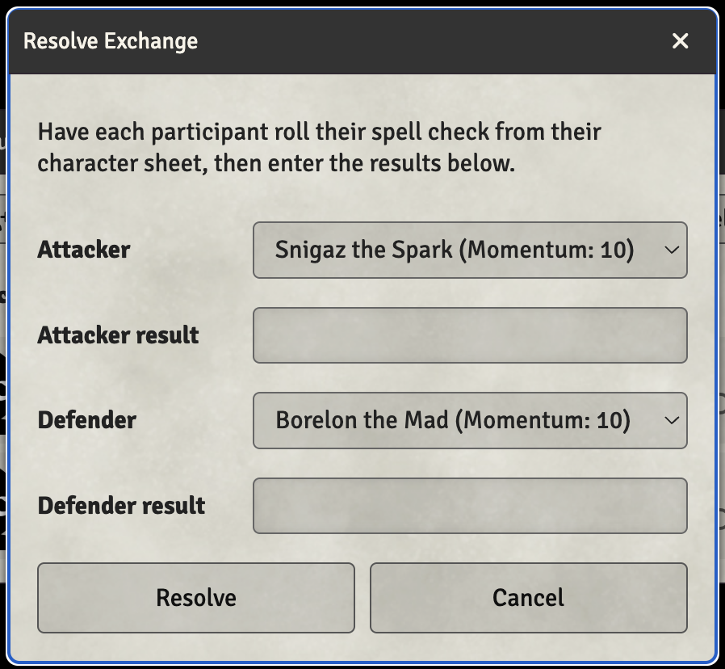

# Spell Duels

## Overview

The DCC system includes a Spell Duel Tracker to help manage wizard duels and counterspell battles. Spell duels in DCC RPG occur when two casters directly oppose each other with magic, and the tracker automates the complex resolution process involving multiple tables from the rulebook.

## Accessing the Spell Duel Tracker

Click the wizard hat icon on the Token Controls bar to open the Spell Duel Tracker dialog.

## Adding Participants

There are two ways to add participants to a spell duel:

1. **Select and Add**: Select one or more tokens on the canvas, then click the "Add Selected" button
2. **Drag and Drop**: Drag an actor from the Actors sidebar or a token from the canvas directly onto the Spell Duel Tracker dialog

Each participant starts with a **Momentum** of 10. Momentum affects the counterspell power roll during exchange resolution.

## Momentum

Momentum is a key mechanic in spell duels. It represents the shifting balance of power between duelists.

- All participants start with a momentum of **10**
- The winner of each exchange gains **+1 momentum**
- Momentum modifies the counterspell power roll (the difference between attacker and defender momentum is applied)

### Judge Controls

The Judge (GM) can manage each participant's momentum:

- **-** / **+**: Decrease or increase momentum by 1
- **Undo icon**: Reset momentum back to 10
- **X icon**: Remove the participant from the duel

## Resolving Exchanges

When two casters clash during a spell duel, click the **Resolve Exchange** button to determine the outcome.

1. Have each participant roll their spell check from their character sheet
2. Click "Resolve Exchange" to open the resolution dialog
3. Select which participant is the attacker and which is the defender
4. Enter each participant's spell check result
5. Click "Resolve"

The system will automatically:

1. Determine the winner based on spell check results
2. Award +1 momentum to the winner
3. Look up the counterspell die from Table 4-5 (if the DCC Core Book module is installed)
4. Roll the counterspell power die
5. Apply the momentum modifier to the roll
6. Look up and display the result from Table 4-6 (Counterspell Power)

Results are posted to the chat log with full details of the exchange.

## Phlogiston Disturbance

When both casters roll identical spell check results, a **Phlogiston Disturbance** occurs! The system automatically rolls on Table 4-7 to determine what strange magical side effect occurs.

Phlogiston Disturbances can result in:

- Pocket dimensions
- Alignment rifts
- Time distortions
- Spells merging
- Supernatural summonings
- Demonic invasions
- Mutual corruption

## DCC Core Book Integration

If you have the **DCC Core Book** module installed and active, the Spell Duel Tracker provides enhanced functionality:

- **Rules Reference**: A book icon appears in the dialog header that links directly to the spell duel rules
- **Full Table Results**: The system looks up complete result descriptions from the module's RollTables instead of just showing effect names
- **Automatic Die Lookup**: Table 4-5 (Spell Duel Check Comparison) is used to determine the correct die to roll

Without the Core Book module, the system will prompt you to look up results in the physical rulebook and provide page references.

## Ending a Duel

Click the **End Duel** button to conclude the spell duel. This clears all participants and their momentum values. A notification is sent to the chat when the duel ends.

## Tips for Running Spell Duels

1. **Before the Duel**: Add all potential duelists to the tracker at the start of combat
2. **During Exchanges**: Have players roll their spell checks normally, then use "Resolve Exchange" to determine outcomes
3. **Track Momentum**: The momentum system naturally tracks who has the upper hand
4. **Describe Results**: Use the table results as inspiration for narrative descriptions of the magical clash

## Player vs Judge View

- **Judges** have full access to all controls: adding/removing participants, adjusting momentum, and resolving exchanges
- **Players** can view the current participants and momentum values but cannot modify them
