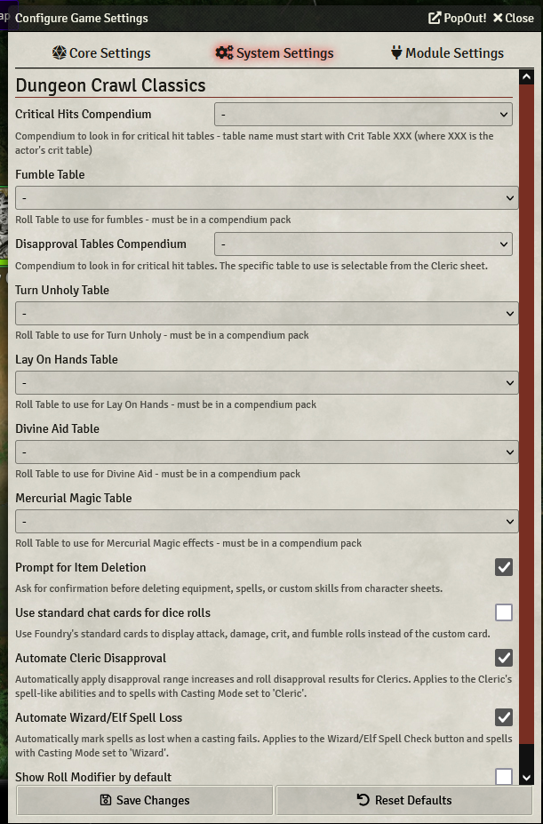

# System Settings

To change System Settings, you can click the 3 gears (**Game Settings**) in the top right corner, then click the **System Settings** tab. Note that **none of these table settings need to be changed out of the box if you have purchased the Core Book module**.

**Critical Hits Compendium** is the compendium where you store your Critical Hits tables. This is a drop down.

**Fumble Table** is the table where you store Fumbles. The drop down shows all the tables you have in Compendiums.

**Disapproval Tables Compendium** is the compendium where you store Cleric Disappproval tables. The Cleric can choose their table from their character sheet.

**Prompt For Item Deletion** is a checkbox that will force a player to confirm they want to delete an item. If it is unchecked, they can delete things without confirmation.

**Use standard chat cards for dice rolls** will change the dice roll display in the chat window to use Foundry's standard dice rolls.

**Shortened Macro Syntax** will allow you to more easily write macros.
