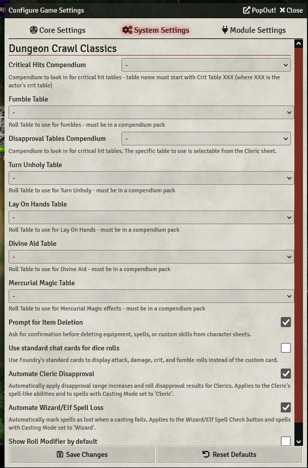

# System Settings

To change System Settings, you can click the 3 gears (**Game Settings**) in the top right corner, then click the **System Settings** tab. Note that **none of these table settings need to be changed out of the box if you have purchased the Core Book module**.

**Manually Configure Compendia** is a checkbox that will allow you to manually configure the compendia used by the system. If this is unchecked, the system will automatically configure the compendia it needs. If it is checked, you will need to manually create the compendia and set them in the fields below. Once checked, you will need to click "Save Settings" and accept the reload before you will see the manual fields.

### These settings are hidden unless you check the **Manually Configure Compendia** checkbox:

**Critical Hits Compendium** is the compendium where you store your Critical Hits tables. This is a drop down.

**Spell Side Effects Compendium** is the compendium where you store Manifestations and Corruptions.

**Fumble Table** is the table where you store Fumbles. The drop down shows all the tables you have in Compendiums.

**Disapproval Tables Compendium** is the compendium where you store Cleric Disappproval tables. The Cleric can choose their table from their character sheet.

**Turn Unholy Table** is the compendium where you store Turn Unholy tables. The Cleric can choose their table from their character sheet.

**Lay on Hands Table** is the table where you store Lay on Hands effects. The Cleric can choose their table from their character sheet.

**Divine Aid Table** is the table where you store Divine Aid effects. The Cleric can choose their table from their character sheet.

**Mercurial Magic Table** is the table where you store Mercurial Magic effects. The Wizard can choose their table from their character sheet.

### These are the settings that are always visible:
**Show rolls as emotes** will change rolls made from character sheets in to compact emotes in the chat log.

**Automate Damage/Crits/Fumbles** will automatically apply damage, critical hits, and fumbles to the chat rolls you roll an attack. If this is unchecked, it will show clickable dice rolls for damage and critical hits in the chat log.

**Automate Cleric Disapproval** will automatically increase the Cleric's Disapproval score when they roll a 1 on a spell casting roll (or under their current disapproval). If this is unchecked, it will not automatically increase the Disapproval score.

**Automated Wizard/Elf Spell Loss** will automatically mark a spell as lost if the spell fails.

**Show the Modify Roll dialog by default** will show the Modify Roll dialog when you roll from the character sheet. If this is unchecked, you will need to cmd/ctrl click to show the Modify Roll dialog.

**Enable Fleeting Luck** will enable Fleeting Luck for the system. If this is unchecked, Fleeting Luck will not be available.

**Automate Fleeting Luck** will automatically add Fleeting Luck on criticals. If this is unchecked, it will not automatically apply Fleeting Luck.

**Check weapon is equipped** will check if the weapon is equipped before rolling an attack, and show an error if it is not equipped.

**Show Welcome Dialog on Startup** will show the Welcome Dialog when you first open the game. If this is unchecked, it will not show the Welcome Dialog.

**Strict Critical Hit Rules** when enabled, makes critical hit ranges scale proportionally with die size changes. For example, if you normally crit on 20 and roll a d24, you only crit on 24. If you normally crit on 18-20 and roll a d24, you crit on 22-24. This setting follows strict RAW interpretation of how critical hits work with the dice chain.

## Combat Automation

These settings add automated combat rules to the system. They are **all off by default**, and each can be turned on independently. They act on the **targeted** token, so for the target-based options (range, firing into melee, damage, monster Luck) you must target a token when you attack — hover over it and press **T**.

> **Using the DCC Quality of Life (dcc-qol) module?** Leave these off. While dcc-qol is active it provides this automation, and the system steps aside so the two never apply a rule twice. These built-in settings are intended for tables that do **not** run dcc-qol.

**Check missile weapon range** applies the DCC range penalties to a ranged (missile) attack against a targeted token, based on the distance between the attacker and the target (DCC core rulebook, p. 96):

- **Medium range:** −2 to the attack roll.
- **Long range:** the action die drops one step down the dice chain (e.g. d20 → d16).
- **Beyond long range:** a prompt asks whether to fire anyway; if you confirm, the shot is made at the long-range penalty.

**Firing into melee penalty** applies a −1 penalty when a ranged attack targets a creature that is in melee with one of the attacker's allies (DCC core rulebook, p. 96) — representing the risk of hitting your friend.

**Player Luck vs monster crits** applies a targeted player character's Luck modifier to a monster's critical hit against them, per DCC rules: a positive Luck modifier reduces the monster's crit roll, a negative one increases it. (When several PCs are targeted, the highest Luck applies.)

**Monster fumbles (Yearbook #8)** is the optional rule from DCC Yearbook #8: when a monster fumbles against player characters, its fumble die is stepped along the dice chain by the highest targeted PC's Luck modifier (base 1d10 → e.g. 1d14 for a +2-Luck target, 1d6 for a −3-Luck target). With this off, monster fumbles use the standard flat 1d10.

**Auto-apply damage to target** automatically applies a hit's rolled damage to the targeted token. The application is performed by the GM, so it works even when a player attacks a monster they don't own. Damage is only applied when the attack hits (the attack total meets the target's AC, or it is a critical hit); a miss or fumble applies nothing.

**Auto-apply dead status to NPCs** automatically adds the "dead" status effect to a non-player character whose hit points drop to 0 or below. Player characters are left alone (at 0 HP they are dying and may recover per DCC rules). The status is added automatically but not removed automatically — a GM can clear it if the creature is healed or revived.
