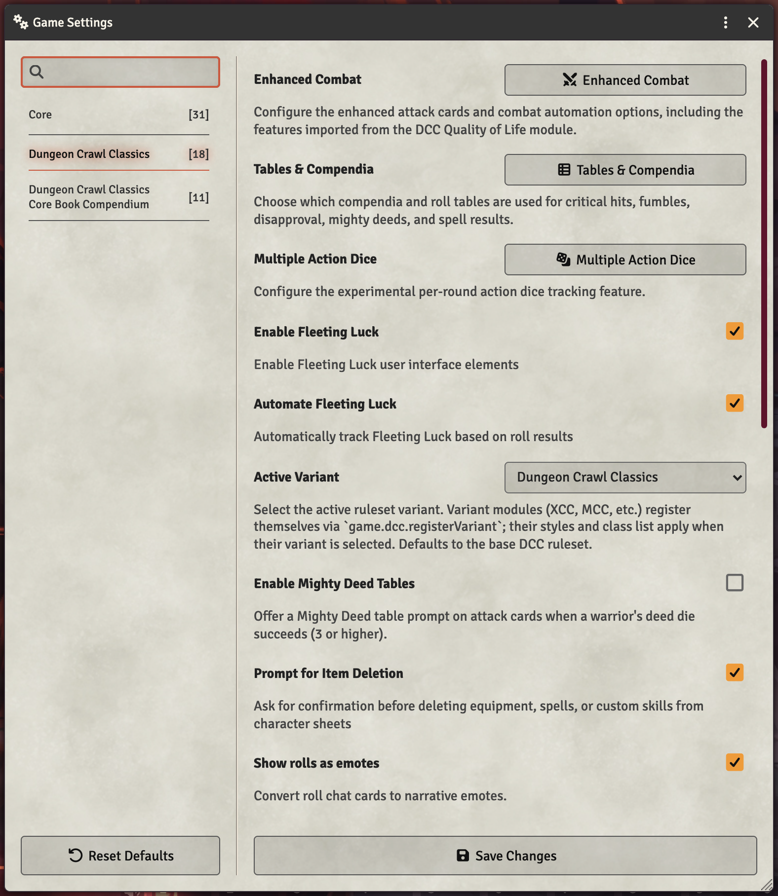

# System Settings

To change System Settings, you can click the 3 gears (**Game Settings**) in the top right corner, then click the **Dungeon Crawl Classics** tab. Note that **none of the table settings need to be changed out of the box if you have purchased the Core Book module**.

At the top of the tab are three buttons that open grouped settings dialogs — **Enhanced Combat**, **Tables & Compendia**, and **Multiple Action Dice** — followed by the standalone settings described [further below](#standalone-settings).

## Enhanced Combat

Click the **Enhanced Combat** button to configure the enhanced attack cards and the built-in combat automation.

### Attack Cards

**Enhanced attack cards** switches attack rolls to a redesigned chat card with a hit/miss banner versus the selected target, the weapon image and name (click to show its description), separate Roll Damage / Crit / Fumble buttons, and a weapon-properties footer. This is a per-player choice — each player can turn it on or off for themselves. The two settings below only apply while it is on.

**Attack card layout** chooses between the **Full** card (complete dice breakdown, full-width buttons) and a **Compact** card (inline die total, condensed buttons).

**Show hit/miss on attack cards** shows whether the attack hit or missed the selected target on the card.

### Combat Automation

**Automate Damage/Crits/Fumbles** will automatically apply damage, critical hits, and fumbles to the chat rolls you roll an attack. If this is unchecked, it will show clickable dice rolls for damage and critical hits in the chat log.

**Check weapon is equipped** will check if the weapon is equipped before rolling an attack, and show an error if it is not equipped.

The remaining settings add automated combat rules to the system. They are **all off by default**, and each can be turned on independently. They act on the **targeted** token, so for the target-based options (range, firing into melee, damage, monster Luck) you must target a token when you attack — hover over it and press **T**.

> **Using the DCC Quality of Life (dcc-qol) module?** Leave these off. While dcc-qol is active it provides this automation, and the system steps aside so the two never apply a rule twice. These built-in settings are intended for tables that do **not** run dcc-qol.

**Check missile weapon range** applies the DCC range penalties to a ranged (missile) attack against a targeted token, based on the distance between the attacker and the target (DCC core rulebook, p. 96):

- **Medium range:** −2 to the attack roll.
- **Long range:** the action die drops one step down the dice chain (e.g. d20 → d16).
- **Beyond long range:** a prompt asks whether to fire anyway; if you confirm, the shot is made at the long-range penalty.

**Firing into melee penalty** applies a −1 penalty when a ranged attack targets a creature that is in melee with one of the attacker's allies (DCC core rulebook, p. 96) — representing the risk of hitting your friend.

**Automate friendly fire** — when a missile attack into melee misses, there is a 50% chance the stray shot is directed at a random ally engaged with the target, who is then attacked normally (DCC core rulebook, p. 96).

**Player Luck vs monster crits** applies a targeted player character's Luck modifier to a monster's critical hit against them, per DCC rules: a positive Luck modifier reduces the monster's crit roll, a negative one increases it. (When several PCs are targeted, the highest Luck applies.)

**Monster fumbles (Yearbook #8)** is the optional rule from DCC Yearbook #8: when a monster fumbles against player characters, its fumble die is stepped along the dice chain by the highest targeted PC's Luck modifier (base 1d10 → e.g. 1d14 for a +2-Luck target, 1d6 for a −3-Luck target). With this off, monster fumbles use the standard flat 1d10.

**Auto-apply damage to target** automatically applies a hit's rolled damage to the targeted token. The application is performed by the GM, so it works even when a player attacks a monster they don't own. Damage is only applied when the attack hits (the attack total meets the target's AC, or it is a critical hit); a miss or fumble applies nothing.

**Auto-apply dead status to NPCs** automatically adds the "dead" status effect to a non-player character whose hit points drop to 0 or below. Player characters are left alone (at 0 HP they are dying and may recover per DCC rules). The status is added automatically but not removed automatically — a GM can clear it if the creature is healed or revived.

**Enable death clock for PCs** implements the DCC death and dying rules for player characters: a PC dropping to 0 hit points begins bleeding out with their level in rounds to be healed (tracked in the combat tracker and the sidebar Death Clock tool), death applied like the tracker's skull button, the permanent Stamina cost of a bleed-out save, and the Roll the Body recovery check. See the [Death Clock](Death-Clock.md) guide for the full feature.

## Tables & Compendia

Click the **Tables & Compendia** button to choose which compendia and roll tables the system uses for lookups.

**Manually Configure Compendia** is a checkbox that will allow you to manually configure the compendia used by the system. If this is unchecked, the system will automatically configure the compendia it needs, and the pickers below are shown grayed out. Checking it enables the pickers; after saving, accept the reload prompt for the change to take effect.

**Critical Hits Compendium** is the compendium where you store your Critical Hits tables. This is a drop down.

**Spell Side Effects Compendium** is the compendium where you store Manifestations and Corruptions.

**Disapproval Tables Compendium** is the compendium where you store Cleric Disappproval tables. The Cleric can choose their table from their character sheet.

**Mighty Deeds Tables Compendium** is the compendium where you store Mighty Deed tables, used by the deed table prompt on attack cards (see [Mighty Deeds](Mighty-Deeds.md)).

**Fumble Table** is the table where you store Fumbles. The drop down shows all the tables you have in Compendiums.

**Turn Unholy Table** is the compendium where you store Turn Unholy tables. The Cleric can choose their table from their character sheet.

**Lay on Hands Table** is the table where you store Lay on Hands effects. The Cleric can choose their table from their character sheet.

**Divine Aid Table** is the table where you store Divine Aid effects. The Cleric can choose their table from their character sheet.

**Mercurial Magic Table** is the table where you store Mercurial Magic effects. The Wizard can choose their table from their character sheet.

## Multiple Action Dice

Click the **Multiple Action Dice** button to configure the experimental multiple-action-dice feature: the master switch plus its sub-options (combat tracker pips, automatic per-round reset, and hiding pips for single-die actors). See [Action Dice](Action-Dice.md) for how the feature works.

## Standalone settings

**Enable Fleeting Luck** will enable Fleeting Luck for the system. If this is unchecked, Fleeting Luck will not be available.

**Automate Fleeting Luck** will automatically add Fleeting Luck on criticals. If this is unchecked, it will not automatically apply Fleeting Luck.

**Vision From All Owned Tokens** (on by default) lets players see from every token they own, even while controlling a single token. Foundry normally limits vision to the controlled token only, so when a player runs several characters — such as during a funnel — a character who walks out of the selected token's line of sight disappears from the map and can't be clicked. With this setting on, all of a player's characters keep providing vision, so they stay visible and selectable wherever they are. Turn it off to use standard Foundry vision. Judges are unaffected either way.

**Active Variant** selects the active ruleset variant. Variant modules (XCC, MCC, etc.) register themselves with the system; their styles and class lists apply when their variant is selected. Leave this on **Dungeon Crawl Classics** unless a variant module tells you otherwise.

**Enable Mighty Deed Tables** offers a Mighty Deed table prompt on attack cards when a warrior's deed die succeeds (3 or higher). See [Mighty Deeds](Mighty-Deeds.md).

**Prompt for Item Deletion** asks for confirmation before deleting equipment, spells, or custom skills from character sheets.

**Show rolls as emotes** will change rolls made from character sheets in to compact emotes in the chat log.

**Automate Cleric Disapproval** will automatically increase the Cleric's Disapproval score when they roll a 1 on a spell casting roll (or under their current disapproval). If this is unchecked, it will not automatically increase the Disapproval score.

**Automated Wizard/Elf Spell Loss** will automatically mark a spell as lost if the spell fails.

**Show the Modify Roll dialog by default** will show the Modify Roll dialog when you roll from the character sheet. If this is unchecked, you will need to cmd/ctrl click to show the Modify Roll dialog.

**Enable Ability Score Log** tracks ability score changes on Player sheets with a reason, recovery expectation, and a per-actor history log — useful for spellburn and stat drain. Click an ability score to record a change: arrows step the new value up or down, and the most likely reason is preselected (Spellburn on physical stats for wizards and elves, Ability Damage otherwise, Luck Spend for Luck).

**Disable icon filter in dark theme** turns off the sepia filter applied to item and sheet icons when using the dark theme (per player).

**Chat Cards Use App Theme** makes chat cards follow the core application light/dark theme setting instead of the interface theme (per player).

**Strict Critical Hit Rules** when enabled, makes critical hit ranges scale proportionally with die size changes. For example, if you normally crit on 20 and roll a d24, you only crit on 24. If you normally crit on 18-20 and roll a d24, you crit on 22-24. This setting follows strict RAW interpretation of how critical hits work with the dice chain.

**Coin Weight (coins per pound)** sets how many coins equal one pound of weight for encumbrance. Default is 10 (B/X style). Set to 0 to disable coin weight entirely.

**Show Welcome Dialog on Startup** will show the Welcome Dialog when you first open the game. If this is unchecked, it will not show the Welcome Dialog.
