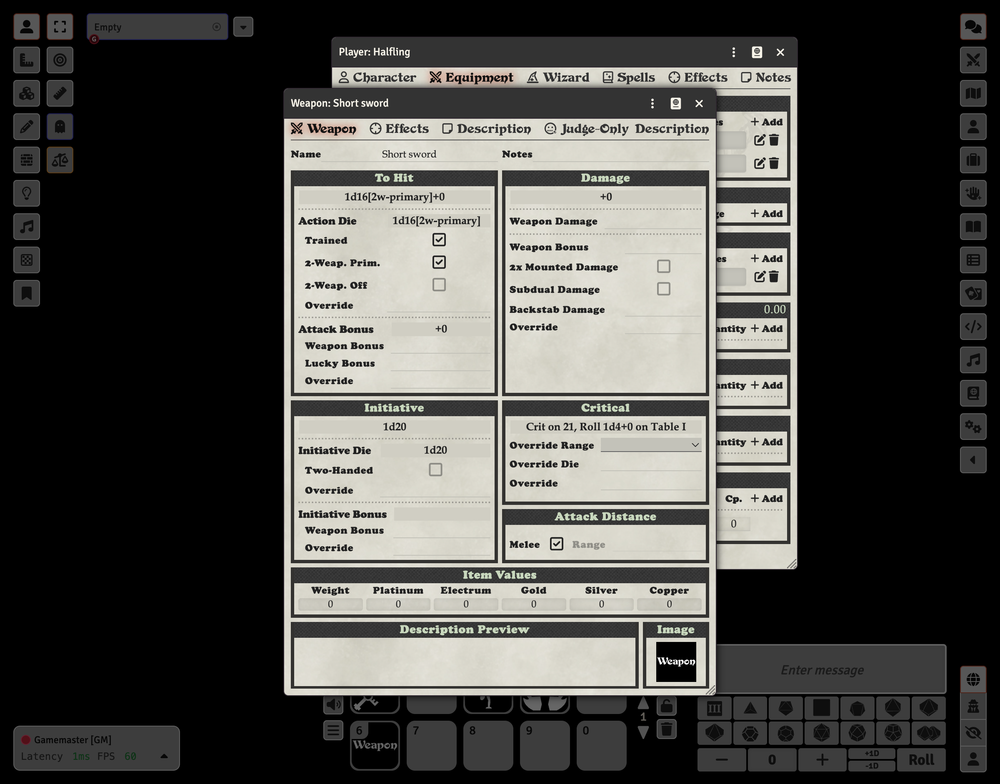

# Two-Weapon Fighting

Two-weapon fighting is commonly used by Halflings, but any character can use this feature. When fighting with two weapons, the system automatically adjusts the action dice for each weapon based on whether it's the primary or off-hand weapon.

## Setting Up Two-Weapon Fighting

To configure two-weapon fighting, you need to create two separate weapon items and mark one as the primary weapon and one as the off-hand weapon.

### Primary Weapon

1. Edit the weapon (click the pencil icon on the Equipment tab)
2. In the **To Hit** section, check **2-Weap. Prim.**
3. The action die will automatically be adjusted (e.g., to 1d16 for Halflings)

### Off-Hand Weapon

1. Edit the second weapon
2. In the **To Hit** section, check **2-Weap. Off**
3. The action die will automatically be adjusted (e.g., to 1d14 for Halflings)

## How It Works

When you check the two-weapon fighting checkboxes:

- **2-Weap. Prim.**: Marks this weapon as the primary hand weapon. The action die is automatically set based on the character's two-weapon fighting primary die.
- **2-Weap. Off**: Marks this weapon as the off-hand weapon. The action die is automatically set based on the character's two-weapon fighting off-hand die.

The action die display will show annotations like `1d16[2w-primary]` or `1d14[2w-off-hand]` to indicate the two-weapon fighting configuration.

## Halfling Two-Weapon Fighting

Halflings are natural two-weapon fighters. When you select the Halfling sheet type, the character is automatically configured with appropriate action dice for two-weapon fighting:

- Primary weapon: d16
- Off-hand weapon: d14

See the [Halfling](Halfling.md) guide for more details on setting up a Halfling character.
