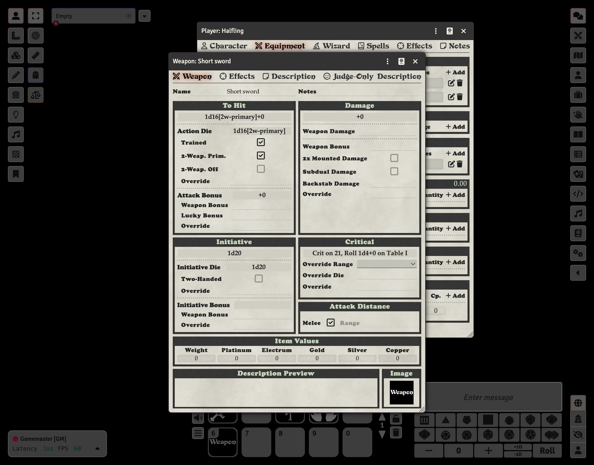

# Two-Weapon Fighting

Two-weapon fighting is commonly used by Halflings, but any character can use this feature. When fighting with two weapons, the system automatically adjusts the action dice for each weapon based on whether it's the primary or off-hand weapon.

## Setting Up Two-Weapon Fighting

To configure two-weapon fighting, you need to create two separate weapon items and mark one as the primary weapon and one as the off-hand weapon.

### Primary Weapon

1. Edit the weapon (click the pencil icon on the Equipment tab)
2. In the **To Hit** section, check **2-Weap. Prim.**
3. The action die will automatically be adjusted (e.g., to 1d16 for Halflings)

### Off-Hand Weapon

1. Edit the second weapon
2. In the **To Hit** section, check **2-Weap. Off**
3. The action die will automatically be adjusted (e.g., to 1d16 for Halflings)

## How It Works

When you check the two-weapon fighting checkboxes:

- **2-Weap. Prim.**: Marks this weapon as the primary hand weapon. The action die is automatically set based on the character's two-weapon fighting primary die.
- **2-Weap. Off**: Marks this weapon as the off-hand weapon. The action die is automatically set based on the character's two-weapon fighting off-hand die.

The action die display will show annotations like `1d16[2w-primary]` or `1d16[2w-off-hand]` to indicate the two-weapon fighting configuration.

## Halfling Two-Weapon Fighting

Halflings are natural two-weapon fighters. When you select the Halfling sheet type, the character is automatically configured with appropriate action dice for two-weapon fighting:

- Primary weapon: d16
- Off-hand weapon: d16

While fighting two-weapon with agility 17 or lower, a halfling scores a critical hit (and an automatic hit) on the maximum face of the die actually rolled — a natural 16 on the usual d16 attacks. When a pair is fought on a smaller extra action die (for example, a 6th-level halfling's second die of 1d14, swung at 1d12), the crit lands on that die's maximum face instead (a natural 12).

### Halfling Fumbles

A halfling fighting with two weapons only fumbles when **both** hands roll a natural 1 in the same round. Each hand is rolled as its own attack, so the system pairs them where it can:

- **In combat** (a combat is started in the combat tracker and the halfling is a combatant), the system matches the primary and off-hand attacks from the same round:
  - If both hands rolled a natural 1, the fumble is rolled on the second attack's card. The first card says the fumble was rolled on the other hand's attack.
  - If only one hand rolled a natural 1, there is no fumble, and the card says so.
- **Outside combat**, or before the other hand has attacked, a natural 1 is a miss and the fumble is held. The card shows a **If both hands rolled a natural 1, roll a fumble** prompt to click if the other hand also rolled a 1. If the other hand then attacks in the same round of combat, the prompt is replaced by the outcome.

Deleting an attack card removes it from pairing, so a misclicked attack can be deleted and rerolled.

See the [Halfling](Halfling.md) guide for more details on setting up a Halfling character.
