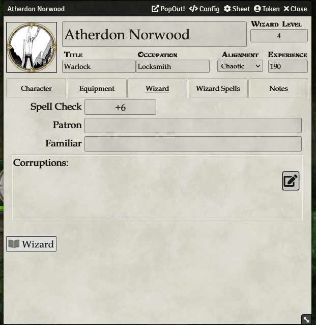
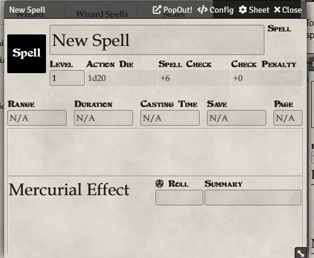

# Wizard

To add spells, first make sure you have a **Spell Check** value set in the **Wizard** tab of your character sheet, which will be used by spells when you roll them.

To add a spell, click the **Wizard Spells** tab, then click **+ Add**. Click the pencil to fill in the details of your spell. You can click the d20 to roll a spell check for that spell.

